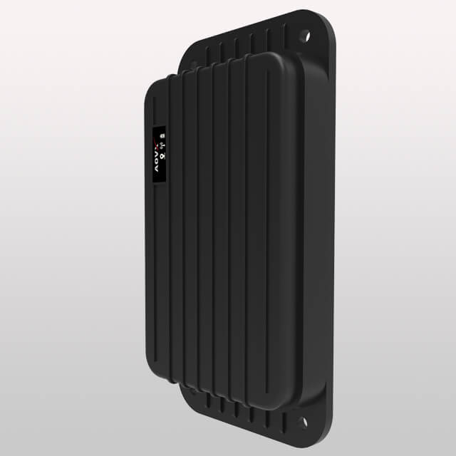

# AOVX - AL300

The AOVX AL300 is a rugged asset tracker designed for long-term monitoring in remote, industrial, and maritime environments. It is intended for use with assets such as containers, trailers, generators, heavy machinery, boats, and personal watercraft, where durable construction and extended operation matter more than frequent maintenance.

As a Plaspy compatible device, the AL300 is relevant for organizations that need dependable asset visibility over long periods. Its focus on passive monitoring, tamper awareness, and optional sensor expansion makes it a practical choice for tracking workflows that rely on location data, event alerts, and consolidated oversight inside Plaspy.

## Key Highlights

- Built for long-term asset tracking with a rugged design suited to demanding environments
- Designed for containers, trailers, generators, heavy machinery, and maritime assets
- IP68 sealing supports use in harsh outdoor conditions and exposure to water and dust
- ATEX minimum safety compliance makes it suitable for certain hazardous environments
- Motion and tamper awareness help detect unauthorized movement or interference
- Optional Bluetooth sensor expansion can extend monitoring with external sensor data
- Long-life battery design supports reduced maintenance and fewer service visits

## How It Works with Plaspy

When the AL300 is used with Plaspy, it can contribute location updates and event information to a single operational view for asset control, fleet monitoring, and anti-theft oversight. This makes it easier to follow long-duration deployments without relying on constant manual checks.

- Track asset position in Plaspy for routine visibility and operational follow-up
- Monitor motion and tamper events to help identify unexpected movement or access
- Use reporting to review asset activity over time and support management decisions
- Combine optional sensor data with location records when external monitoring is needed
- Support long-term supervision of remote assets with fewer site visits
- Apply Plaspy alerts and dashboards to improve response to unusual events

## Typical Use Cases

- Container tracking for logistics, storage, and yard management
- Trailer monitoring for fleet and asset protection programs
- Generator oversight in remote or industrial locations
- Heavy equipment visibility for construction, mining, or field operations
- Maritime asset tracking for boats, personal watercraft, and coastal equipment
- Hazardous-area monitoring where rugged construction and safety awareness are important

## Why Choose This Tracker with Plaspy

The AL300 is a strong fit for Plaspy users who need a durable tracker focused on assets rather than driver-centric vehicle telemetry. Its long-life design, rugged enclosure, and tamper awareness support use cases where reliability and low maintenance are essential. For organizations managing equipment across dispersed sites, this can provide a practical way to keep important assets visible inside Plaspy.

It is especially relevant when the goal is to monitor valuable equipment over time, combine location data with event-driven oversight, and reduce the burden of frequent servicing. To learn more about Plaspy and how it supports asset and fleet tracking, visit the main website at https://www.plaspy.com. Product details, availability, and manufacturer specifications may change over time, so current information should be verified on the official AOVX website at https://www.aovx.com/.
