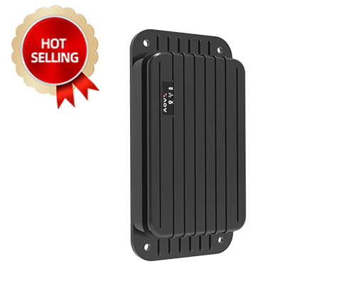

# AOVX - AM300

The AOVX AM300 is an industrial-grade GPS tracker designed for long-term asset deployments. It combines GPS and BeiDou GNSS with base station and Wi-Fi positioning, and it supports multiple connectivity options for broad deployment scenarios. With a rugged IP68 housing, magnetic mounting, and a focus on low-power operation, it is built for environments where dependable tracking and reduced maintenance are important.

The AM300 is also relevant for users looking for an AOVX AM300 compatible with Plaspy. As a Plaspy-ready tracking device, it can contribute location data, event alerts, and asset visibility to a centralized monitoring workflow. That makes it a practical option for organizations that need AOVX AM300 tracking software for remote assets, anti-theft oversight, and fleet tracking use cases.

## Key Highlights

- Built for long-term asset deployments with a focus on dependable monitoring
- Compatible with Plaspy for location tracking, alerts, and historical reporting
- Uses GPS, BeiDou, base station, and Wi-Fi positioning for flexible coverage
- Designed for low-power operation with up to 7 years of battery life in typical reporting configurations
- Rugged IP68 enclosure suited to indoor and outdoor placements
- Strong magnetic mounting supports secure placement on assets
- Motion, vibration, and tamper or displacement alarms help support anti-theft workflows

## How It Works with Plaspy

When connected to Plaspy, the AM300 can contribute location and event data to a centralized fleet management and asset tracking environment. Plaspy helps organize that information into practical workflows such as live visibility, alert handling, historical review, and operational reporting, making it easier to supervise assets across different locations and conditions.

- View live asset location and movement activity in Plaspy
- Receive alerts for motion, vibration, and tamper related events
- Review historical location and event records for audits and analysis
- Improve visibility in situations where indoor or assisted positioning is useful
- Use Plaspy reporting tools to support fleet management and asset oversight
- Consolidate tracker data into a single platform for easier monitoring

## Typical Use Cases

- Long-term tracking of valuable assets in mixed indoor and outdoor environments
- Anti-theft monitoring for equipment that may be moved, disturbed, or tampered with
- Remote oversight of assets that need infrequent maintenance and long battery life
- Fleet and logistics operations that benefit from centralized visibility in Plaspy
- Monitoring of equipment placed in storage yards, service areas, or distributed work sites
- Asset supervision where magnetic mounting and rugged housing are practical advantages

## Why Choose This Tracker with Plaspy

The AM300 can be a strong fit for organizations that want a durable GPS tracker with broad positioning support and long-term deployment in mind. Its combination of multi-mode location methods, security oriented alarms, and low-power design makes it suitable for asset monitoring programs that depend on stable visibility rather than frequent manual checks. Within Plaspy, those capabilities can be turned into practical tracking, alerting, and reporting workflows.

For teams evaluating AOVX AM300 fleet tracking or broader asset telemetry, the main value is straightforward integration into a platform that helps keep monitoring centralized and actionable. If you want to learn more about Plaspy and how it supports compatible devices, visit the main website at https://www.plaspy.com. Product details, availability, and specifications may change over time, so it is a good idea to verify the latest information on the manufacturer's official website at https://www.aovx.com/.
