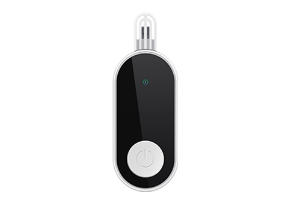

# AOVX - EB100

The AOVX EB100 is a compact environmental sensor tag designed to monitor conditions during storage and transport. It is built for tracking temperature, humidity, light, and motion, making it a practical option for shipments and assets that need condition visibility rather than standalone GPS positioning.

For organizations using Plaspy, the EB100 is relevant because it can contribute environmental data to the platform when paired with BLE gateways or smartphones that forward readings. That makes the AOVX EB100 a useful companion device in Plaspy environments where fleet tracking, warehouse oversight, and shipment monitoring all need to work together.

## Key Highlights

- Compact environmental sensor tag for transport and storage monitoring
- Measures temperature, humidity, light, and motion
- Designed for Bluetooth Low Energy based data collection
- Compatible with Plaspy through gateways or smartphones that forward data
- Useful for condition monitoring alongside GPS trackers in Plaspy
- Suitable for workflows that need event visibility and historical records
- Small form factor that fits packages, pallets, and other assets

## How It Works with Plaspy

The EB100 sends environmental readings through Bluetooth Low Energy, and nearby BLE gateways or compatible smartphones can forward that information into Plaspy. In practice, this lets teams combine the EB100’s condition data with Plaspy’s tracking and monitoring tools to improve visibility across shipments, storage sites, and mobile operations.

- Environmental data can be viewed and organized inside Plaspy for ongoing monitoring
- Temperature, humidity, light, and motion readings can support alerts and event review
- Gateway or smartphone forwarding makes the EB100 useful in connected workflows
- Historical records in Plaspy can help teams review conditions during transit or storage
- The device can complement GPS trackers by adding product or cargo condition data
- Site-level visibility can improve when the EB100 is used in warehouses, vehicles, or loading areas

## Typical Use Cases

- Cold chain monitoring for sensitive goods in transit or storage
- Warehouse condition tracking for stored inventory and work areas
- Shipment visibility for packages and pallets that require environmental oversight
- Asset monitoring where light or motion events may indicate handling or exposure
- Fleet workflows where location tracking in Plaspy is paired with cargo condition data

## Why Choose This Tracker with Plaspy

The EB100 is a good fit for teams that need more than location data alone. When used with Plaspy, it adds environmental context that can help improve oversight of goods, storage spaces, and transport operations without introducing unnecessary complexity.

For businesses managing fleets, inventory, or sensitive shipments, the AOVX EB100 can be a practical companion to Plaspy tracking workflows. To learn more about how Plaspy supports connected tracking and monitoring solutions, visit the main website at https://www.plaspy.com. Product details, availability, and specifications may change over time, so it is always best to verify the latest information on the manufacturer’s official website at https://www.aovx.com/.
