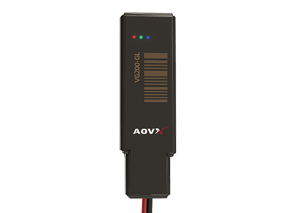

# AOVX - VG200

The AOVX VG200 is an ultra-small vehicle GPS tracker designed for discreet monitoring of motorcycles and compact vehicles. It is built for situations where a low-profile device is preferred, combining real-time location tracking with essential vehicle control features that help operators keep visibility over movement and status.

As a Plaspy compatible device, the VG200 fits naturally into fleet tracking and anti-theft workflows. Plaspy can use the tracker’s location and event data to support live oversight, route review, alerting, and remote response from a single tracking platform.

## Key Highlights

- Ultra-small design that supports discreet placement on motorcycles and small vehicles
- Plaspy compatible for use in real-time tracking and fleet oversight workflows
- Multi-mode positioning with GPS, BeiDou, cellular base station support, and Wi-Fi assisted positioning
- Real-time tracking and route history viewing for day-to-day monitoring
- ACC ignition monitoring for engine activity awareness and usage analysis
- Remote fuel and power cut-off support for anti-theft response and vehicle control
- Focused feature set that suits cost-conscious deployments

## How It Works with Plaspy

When the VG200 is connected to Plaspy, the platform can present its location and event information in a practical operational view. This helps users monitor vehicles in real time, review movement history, and respond to important events such as ignition activity or suspected misuse.

- View live location updates on Plaspy maps for current fleet visibility
- Review historical routes and trip patterns to understand vehicle usage
- Monitor ACC ignition events to detect engine on and engine off activity
- Use alerts and notifications to support faster response to security or operational events
- Apply remote fuel and power cut-off actions through Plaspy when authorized
- Combine position data from multiple sources to improve visibility in challenging environments

## Typical Use Cases

- Motorcycle fleet tracking for delivery, service, or shared mobility operations
- Discreet vehicle monitoring where a compact tracker is preferred
- Anti-theft tracking for bikes and small vehicles
- Basic fleet management with ignition activity visibility and route review
- Recovery support for vehicles that need fast location confirmation after a security incident

## Why Choose This Tracker with Plaspy

The VG200 is a practical option for organizations that want compact tracking hardware with the core features needed for location awareness and event-based control. Its small size, multi-mode positioning, and remote cut-off capability make it a sensible fit for users who need straightforward vehicle monitoring without unnecessary complexity.

Used with Plaspy, the AOVX VG200 GPS tracker can support fleet tracking, vehicle recovery, and day-to-day oversight in a single environment. To learn more about Plaspy and how it supports tracking operations, visit the main website at https://www.plaspy.com. Product details, availability, and manufacturer specifications may change over time, so current information should be verified on the official AOVX website at https://www.aovx.com/.
