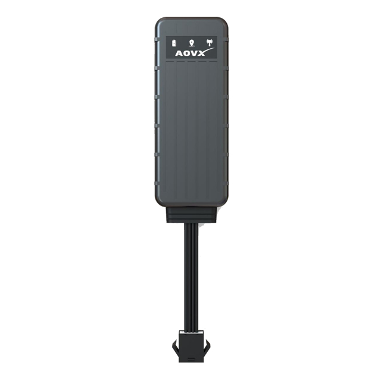

# AOVX - VL100

The AOVX VL100 is a compact GPS tracker designed for straightforward vehicle monitoring and long term fleet visibility. It is positioned as a cost effective wired device for cars, trucks, and other vehicles where dependable location tracking, ignition awareness, and anti theft support are important.

For teams looking for an AOVX VL100 GPS tracker that can work with Plaspy, this model is relevant because it supports the GT06 communication protocol and is described as a Plaspy compatible device. That makes it a practical option for organizations that want to centralize vehicle tracking, alerting, and operational oversight inside Plaspy without relying on a complex deployment.

## Key Highlights

- Compact wired tracker built for vehicle monitoring and everyday fleet use
- Plaspy compatible integration through the GT06 communication protocol
- 4G connectivity with automatic fallback to 2G for broader network continuity
- Wide input voltage support for use across different vehicle types
- Local storage for up to 10,000 position records for historical playback
- Remote immobilizer support and ignition detection for anti theft workflows
- Firmware update support through USB or over the air maintenance

## How It Works with Plaspy

The VL100 can send location and event information into Plaspy using the GT06 protocol, allowing the platform to present the device on live maps, generate reports, and support alerts and operational workflows. In practical terms, this makes the AOVX VL100 tracking software experience useful for businesses that need a simple way to watch vehicles and respond to important movement or status changes.

- Live location visibility in Plaspy for route monitoring and day to day oversight
- Ignition status tracking for trip logging and vehicle activity review
- Support for alert based workflows in Plaspy when defined events are received
- Historical playback using stored records when connectivity is interrupted and data is later recovered
- Remote immobilizer related monitoring and control for anti theft processes where enabled in the deployment
- Fleet level reporting that helps teams review movement patterns and operational use

## Typical Use Cases

- Fleet management for light commercial vehicles that need routine location visibility
- Insurance telematics programs that depend on basic movement and ignition reporting
- Anti theft monitoring for vehicles that benefit from remote immobilizer support
- Association level vehicle supervision for shared or pooled transport assets
- Operational tracking for organizations that want a low cost vehicle tracker with Plaspy integration

## Why Choose This Tracker with Plaspy

The VL100 is a sensible fit for organizations that want a Plaspy compatible tracker with a practical feature set and a focus on reliable vehicle monitoring. Its GT06 support, wired design, and network fallback behavior make it suitable for straightforward deployment in environments where steady tracking and basic control functions matter more than advanced hardware complexity.

Used with Plaspy, the AOVX VL100 can support live tracking, reporting, alerting, and anti theft oversight in a single platform. That combination makes it especially useful for fleets, insurers, and monitoring teams that want an affordable tracker with predictable integration and clear operational value. To learn more about how Plaspy supports vehicle tracking and fleet management, visit the main website at https://www.plaspy.com. Product details, availability, and manufacturer specifications may change over time, so it is best to verify current information in the official AOVX documentation at https://www.aovx.com/.
