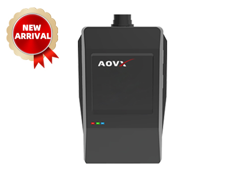

# AOVX - VL350

The AOVX VL350 is a robust GPS tracker designed for vehicle and trailer tracking where reliable location reporting and operational visibility matter. It is built for fleet management and asset recovery workflows, making it suitable for organizations that need dependable tracking across changing environments and asset types.

As a Plaspy compatible device, the VL350 fits naturally into real-time tracking dashboards and fleet management operations. Its positioning assistance, cellular connectivity, and support for additional telemetry make it a practical option for users looking for AOVX VL350 GPS tracker integration with Plaspy.

## Key Highlights

- Plaspy compatible GPS tracker designed for vehicle and trailer monitoring
- Multi-constellation positioning with GPS and Beidou support
- Location assistance through cell ID and WiFi sources for more resilient tracking
- Global 4G LTE Cat.1 connectivity for wide-area fleet visibility
- BLE 5.0 support for compatible sensors and beacons
- ACC ignition monitoring and remote cut-off control for recovery workflows
- Long-life battery and solar power capability for extended off-grid use

## How It Works with Plaspy

When used with Plaspy, the VL350 can feed location and status information into a centralized platform for monitoring vehicles, trailers, and other mobile assets. That gives fleet operators a clearer operational picture, especially when assets are dispersed, detached, or stored away from the main vehicle.

- Real-time location tracking for trailers and vehicles inside Plaspy dashboards
- Event-based monitoring for ignition status and movement-related changes
- Alerting and geofence workflows that help teams react to unexpected activity
- Support for remote recovery and immobilization scenarios where those functions are used
- Additional sensor visibility through BLE compatible peripherals when deployed in the field
- Reporting and history views that help teams review routes, stops, and asset usage patterns

## Typical Use Cases

- Trailer fleet management for pooled, leased, or rented assets
- Vehicle tracking where consistent location visibility is required
- Asset recovery workflows for theft deterrence and rapid response
- Depot and yard monitoring for equipment that may be parked or stored for long periods
- Sensor assisted cargo oversight where compatible external devices are part of the operation

## Why Choose This Tracker with Plaspy

The VL350 is a useful fit for organizations that want a Plaspy compatible tracker with a focus on resilient positioning, fleet visibility, and recovery-oriented features. It is especially relevant when the asset may operate indoors, outdoors, or in transit and when location reliability matters more than a single source of positioning data.

For teams evaluating AOVX VL350 tracking software or AOVX VL350 fleet tracking with Plaspy, this model offers a balanced approach to monitoring, alerts, and operational control without overcomplicating the deployment. To learn more about Plaspy and how it supports connected asset tracking, visit the main website at https://www.plaspy.com. Product details, availability, and manufacturer specifications may change over time, so current information should always be verified on the official AOVX website at https://www.aovx.com/.
