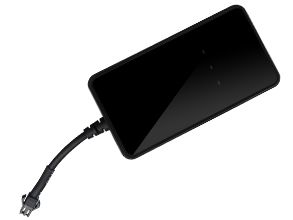

# AoYa - A12

The AoYa A12 is a compact automotive GPS tracker designed for vehicle location monitoring. At roughly 88mm x 46mm x 16mm and weighing about 80g, the A12 is intended to be unobtrusive while delivering continuous position updates using GPS, LBS, and AGPS technologies. The device pairs a UBLOX GPS receiver with a SIMTK6260 GSM chipset to provide positioning with reported sensitivity and typical accuracy in the 5–10 meter range, and it includes a built-in 3.7V 250mAh Li-ion battery for short-term backup power.

As a Plaspy compatible device, the A12 can feed live and historical location information into Plaspy's fleet monitoring environment, enabling centralized visibility alongside other trackers. This compatibility makes the A12 a practical option for organizations that want to integrate compact automotive trackers into Plaspy for routine vehicle oversight, reporting, and operational management without introducing unnecessary complexity.

## Key Highlights

- Compact form factor suitable for a wide range of vehicle installations
- GPS LBS and AGPS tracking for improved location acquisition and coverage
- UBLOX GPS receiver combined with a SIMTK6260 GSM chipset for reliable positioning
- Reported GPS sensitivity of −159 dBm and typical accuracy around 5–10 meters
- Built-in 3.7V 250mAh Li-ion battery provides emergency backup power
- Lightweight design (approximately 80 g) that is easy to accommodate in vehicle fleets

## How It Works with Plaspy

When used with Plaspy, the AoYa A12 supplies location data that Plaspy presents in dashboards, maps, and reports to support operational decisions. Plaspy aggregates incoming device data so fleet managers can maintain oversight of vehicles across locations and time.

- Real-time location display on Plaspy maps for monitoring active trips and vehicle positions
- Historical route playback and reporting to review trips and analyze utilization
- Alerts and notifications based on location events such as geofence entries and exits
- Centralized device list and status information to monitor a fleet of A12 trackers
- Consolidated exports and activity summaries to support operational reporting

## Typical Use Cases

- Real-time tracking of company cars and service vehicles
- Fleet monitoring for delivery and logistics operations
- Rental car location oversight and return verification
- Asset security and location checks for light commercial vehicles
- Operational visibility for mixed small vehicle fleets

## Why Choose This Tracker with Plaspy

The AoYa A12 is a pragmatic choice for organizations that need a compact, automotive-focused tracker that integrates into a broader fleet management platform. Its modest size and reported positioning performance make it suitable for businesses that want straightforward vehicle tracking without a large hardware footprint. Combined with Plaspy, the A12 can contribute to improved route visibility, simpler reporting, and consolidated fleet oversight.

Because the A12 provides backup power and mainstream positioning hardware, it can help maintain continuity of location data in many everyday fleet scenarios. If you require more advanced telemetry or very specific hardware features, review those needs alongside the A12’s capabilities to ensure a good match with your operational goals.

To learn more about Plaspy and how compatible trackers like the AoYa A12 can be used in fleet management, visit https://www.plaspy.com. Product specifications, availability, and manufacturer details can change over time; please verify current technical information on the manufacturer's website at http://www.aoyagps.com/.
