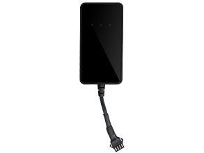

# AoYa - A14

The AoYa A14 is a compact automotive GPS tracker designed to provide real-time vehicle location monitoring. At 88mm x 46mm x 16mm and weighing 80g, it is built for discreet installation in passenger cars and light commercial vehicles. The A14 supports GPS, LBS, and AGPS positioning and includes a UBLOX GPS chipset for reportedly high sensitivity and a typical accuracy range of about 5–10 meters as described by the manufacturer.

As a Plaspy compatible device, the A14 can feed its location and status into the Plaspy fleet management platform to provide continuous visibility and operational oversight. Plaspy users can add the A14 to their device inventory to take advantage of centralized tracking, reporting, and alerting features while retaining the practical benefits of the tracker such as emergency battery backup and mobile compatibility with Android and iOS.

## Key Highlights

- Compact form factor suitable for unobtrusive vehicle installation and fleet use
- GPS, LBS, and AGPS positioning to support location tracking in varied conditions
- UBLOX GPS receiver with manufacturer stated sensitivity and 5–10m accuracy range
- GSM modem support for cellular communication and remote tracking
- Built-in emergency battery for continued operation during power loss
- Compatible with both Android and iOS tracking interfaces
- One year manufacturer warranty for basic assurance

## How It Works with Plaspy

When integrated with Plaspy, the AoYa A14 becomes a source of location and status data that can be visualized, reported, and acted upon within the Plaspy platform. Plaspy can consolidate multiple A14 units alongside other compatible devices to provide a single operational view for vehicle fleets.

- Real-time location display on Plaspy maps for individual vehicles or grouped fleets
- Historical route playback and basic trip reporting to review movements over time
- Geofence and location-based alerts configured in Plaspy to notify managers of events
- Fleet status dashboards to monitor active devices and recent activity
- Exportable location and event data for operational analysis and record keeping

## Typical Use Cases

- Small to medium fleet location tracking for routing and dispatch visibility
- Vehicle security and recovery support where continuous position reporting is needed
- Remote monitoring for company cars and high-value assets in mixed environments
- Mobile workforce oversight to confirm vehicle movements and service coverage
- Temporary or supplemental tracking where a compact device is preferred

## Why Choose This Tracker with Plaspy

The AoYa A14 pairs practical vehicle tracking hardware with Plaspy's fleet management features to deliver a straightforward solution for organizations seeking improved visibility. Its compact size and emergency battery make it a versatile option for fleets that require discreet installation and basic continuity during power interruptions.

Because the A14 supports standard positioning and cellular communications and is compatible with common mobile platforms, it integrates well into Plaspy's device-agnostic approach to tracking. For teams that need centralized monitoring, alerting, and reporting without complex hardware requirements, the A14 represents a balanced choice when used with Plaspy.

To learn more about how Plaspy can work with devices like the AoYa A14, visit https://www.plaspy.com. Please note that product specifications, availability, and manufacturer details can change over time; verify current specifications and warranty information on the manufacturer's official website http://www.aoyagps.com/.
