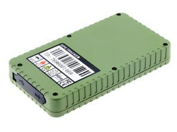

# AoYa - A202

The AoYa A202 is an automotive GPS tracker designed for vehicle and asset monitoring. It combines a compact form factor (130mm x 72mm x 20mm) and light weight (240g) with GNSS positioning based on a UBLOX chip. The device supports GSM GPRS network connectivity for real-time location reporting and provides positioning accuracy on the order of meters, making it suitable for fleet management, personal vehicle tracking, and general asset tracking where concealment and easy installation are desirable.

As a Plaspy compatible device, the A202 can feed live and historical location data into the Plaspy platform to support monitoring, alerts, and reporting workflows. Its long 10000mAh battery and rugged waterproof and dustproof enclosure help maintain tracking continuity in long-term deployments and harsh conditions, which improves visibility and reduces the need for frequent maintenance when used with a fleet tracking solution like Plaspy.

## Key Highlights

- Compact and lightweight design suitable for concealed vehicle installation and easy placement in assets.
- UBLOX GPS chip provides reliable position fixes with meter-level accuracy for operational visibility.
- GSM GPRS connectivity enables continuous location updates for real-time monitoring.
- Large 10000mAh battery supports extended tracking durations for long-term deployments.
- Waterproof and dustproof construction improves reliability in outdoor and rough environments.
- Suitable for fleet, personal vehicle, and general asset tracking scenarios.

## How It Works with Plaspy

When integrated into Plaspy, the AoYa A202 supplies location and basic status information that Plaspy presents through dashboards, maps, and alerts. Plaspy ingests the tracker data and makes it available for live monitoring, historical review, and operational reporting without requiring detailed changes to device hardware.

- Real-time location display on Plaspy maps for active monitoring of vehicles and assets.
- Historical route playback and trip reconstruction to review movements over time.
- Geofence alerts and location-based notifications routed through Plaspy to inform operations teams.
- Speed monitoring and event markers to support operational oversight and incident review.
- Battery and device status visibility to help schedule maintenance and reduce downtime.
- Reporting and exportable logs for compliance, billing, or operational analysis.

## Typical Use Cases

- Fleet vehicle tracking for delivery, service, and field teams.
- Long-term asset monitoring where extended battery life is important.
- Personal vehicle tracking for security and location recovery.
- Rental or shared vehicle oversight with location and movement history.
- Equipment tracking in outdoor or harsh environments thanks to waterproof design.

## Why Choose This Tracker with Plaspy

The AoYa A202 is a practical choice for organizations that need a compact, durable tracker with strong battery endurance and reliable positioning. Its UBLOX-based positioning and GSM GPRS connectivity make it a sensible fit for common fleet and asset tracking workflows, while the rugged enclosure helps maintain data continuity in adverse conditions. When paired with Plaspy, the A202 can contribute to a straightforward monitoring setup that emphasizes visibility and operational reliability.

Because product specifications and feature sets can vary by region and firmware revision, consider the A202 as a compatible option within a broader device strategy rather than the sole solution for every use case. Plaspy provides the platform tools for map visualization, alerts, and reporting that complement the A202's strengths, enabling teams to tailor tracking and oversight to their operational needs.

To explore how the AoYa A202 fits into your tracking setup and to learn more about Plaspy visit https://www.plaspy.com. Product specifications, availability, and manufacturer details can change over time, so please verify current specifications on the manufacturer's official website http://www.aoyagps.com/ before final deployment.
