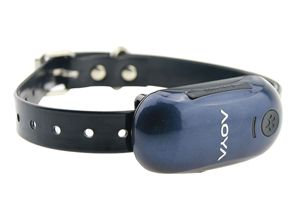

# AoYa - A516

The AoYa A516 GPS Tracker is a compact and versatile device designed for automotive use. With its small dimensions of 70mmx35mmx20mm, it can easily be installed in any vehicle without taking up much space. This GPS tracker is perfect for keeping track of your vehicle's location and ensuring its safety and security.

The A516 GPS Tracker utilizes GSM/GPRS network technology, allowing for real-time tracking and monitoring. It features a high-quality GPS chip from UBLOX, which provides accurate positioning with a sensitivity of -159dBm and an accuracy of 5-10 meters. This ensures that you can always pinpoint the exact location of your vehicle.

One of the standout features of the AoYa A516 GPS Tracker is its changeable 3.7V 1000mAh Li-ion battery. This battery provides a long-lasting power source, allowing for continuous tracking and monitoring. The battery is easily replaceable, ensuring that you can always keep your GPS tracker powered up and ready to go.

The AoYa A516 GPS Tracker is not only suitable for automotive use but can also be used for personal tracking. Its compact size makes it ideal for attaching to a pet's collar, ensuring that you can always keep an eye on your furry friend's whereabouts. With its reliable performance and user-friendly design, the AoYa A516 GPS Tracker is a great choice for anyone in need of a reliable and versatile tracking device.

### Outstanding Features:

- Compact and versatile design
- Real-time tracking and monitoring
- High-quality GPS chip for accurate positioning
- Changeable 3.7V 1000mAh Li-ion battery for long-lasting power
- Suitable for automotive and personal tracking

### Technical Specifications:

- Type: GPS Tracker
- Use: Automotive
- Screen Size: No screen
- Function: GPS tracking
- Place of Origin: Guangdong, China \(Mainland\)
- Brand Name: AOYA
- Model Number: A516
- Warranty: 1 Year
- Dimension: 70mmx35mmx20mm
- Network: GSM/GPRS
- GSM chip: MTK
- GPS chip: UBLOX
- GPS sensitivity: -159dBm
- GPS accuracy: 5-10m
- Battery: Changeable 3.7V 1000mAh Li-ion Battery
- Items Name: Mini Personal Dog Cat Collar Pet ID Locator GPS Tracker GSM Tracking

