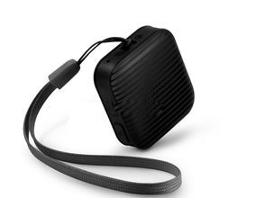

# AoYa - A8

The AoYa A8 is a compact personal GPS tracker designed for real time location monitoring and basic safety functions. With small dimensions and a lightweight body, the A8 is intended to be carried, worn, or attached to belongings where discreet, continuous tracking is needed. The device includes an SOS button for emergency signaling, voice monitoring and two way audio capability via a built in microphone, and supports GSM frequency bands for broad cellular coverage.

As a tracker that provides live tracking and remote audio monitoring, the A8 can be integrated into Plaspy to extend situational visibility and safety workflows. Compatibility with Plaspy lets organizations and individuals view the A8's location on Plaspy maps, receive event notifications such as SOS alerts, and include A8 units in reporting and monitoring dashboards alongside other devices managed on the platform.

## Key Highlights

- Very compact and lightweight form factor suitable for personal carry or discreet attachment
- Live tracking capability for near real time position updates through a platform or app
- Dedicated SOS button to send distress notifications when activated
- Voice monitoring and two way audio for remote listening and communication
- Multi day battery runtime from a rechargeable internal battery, suitable for extended use between charges
- Supports common GSM frequency bands for wide cellular coverage across regions

## How It Works with Plaspy

When used with Plaspy, the AoYa A8 becomes part of a unified tracking environment where location and status can be monitored centrally. Plaspy ingests location and alert data from compatible trackers so administrators and caregivers can maintain awareness, create alerts, and run operational reports.

- Live location displayed on Plaspy maps for continuous visibility
- SOS alerts forwarded to Plaspy for immediate notification to assigned users
- Voice monitoring and two way audio status available as part of device details within the platform
- Inclusion in Plaspy grouping and labeling for organized fleet or device management
- Historical movement and event logs available for reporting and review in Plaspy

## Typical Use Cases

- Personal safety monitoring for children, elderly family members, or lone workers
- Short term asset tracking for portable valuables or equipment
- Emergency response and welfare checks using the SOS function
- Remote monitoring where discreet or lightweight tracking is preferred
- Situations requiring occasional two way audio or voice monitoring for reassurance

## Why Choose This Tracker with Plaspy

The AoYa A8 is a practical choice when the priority is a small, portable device with live tracking and direct safety features. Its compact size and straightforward feature set make it easy to deploy for personal protection, asset oversight, or situations where minimal hardware footprint is important. Paired with Plaspy, the A8 can be managed alongside a diverse set of devices, enabling consolidated visibility and simpler operational oversight.

Because the A8 focuses on core tracking and safety functions, organizations that need a lightweight, easy to carry tracker will find it a reasonable match for Plaspy. The platform capability to centralize alerts, map views, and historical logs helps turn the raw device telemetry into actionable information for monitoring teams and caregivers.

To learn more about Plaspy and how compatible devices are managed on the platform visit https://www.plaspy.com. Product specifications and availability can change over time, so please verify current details and technical documentation on the manufacturer site http://www.aoyagps.com/.
