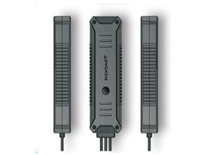

# AoYa - super mini

The AoYa Super Mini GPS Tracker is a compact and versatile tracking device that combines GPS, LBS, and WIFI technologies to provide accurate and real-time tracking information. With its super mini size and built-in light sensor, this tracker is perfect for discreetly monitoring vehicles in various applications, such as car rental companies and small fleet management.

One of the standout features of the AoYa Super Mini GPS Tracker is its real-time tracking capability. You can easily monitor the location of your vehicles in real-time, ensuring that you have up-to-date information on their whereabouts. Additionally, the tracker offers a range of alarm functions, including light alarm, power cut alarm, over speed alarm, and vibration alarm, allowing you to receive instant notifications in case of any suspicious activities or emergencies.

Another useful feature of this tracker is the ability to remotely cut off the oil or engine of the vehicle. This can be particularly helpful in situations where unauthorized use or theft is suspected, as it allows you to immobilize the vehicle and prevent further movement. The tracker also supports geo-fencing, which enables you to set up virtual boundaries for your vehicles and receive alerts whenever they enter or exit these predefined areas.

Furthermore, the AoYa Super Mini GPS Tracker offers a history route playback function, allowing you to review the past movements of your vehicles. This can be useful for analyzing driving patterns, identifying inefficiencies, and improving overall fleet management.

Overall, the AoYa Super Mini GPS Tracker is a reliable and feature-packed device that provides comprehensive tracking and monitoring capabilities for car rental companies, small fleet management, and other similar applications. Its compact size, advanced alarm functions, and remote control options make it an excellent choice for ensuring the safety and security of your vehicles.

