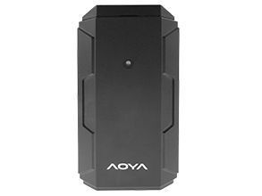

# AoYa - T128GPS

The AoYa T128GPS is a compact GPS tracker designed for personal and asset tracking. It combines a strong magnetic housing with built in GPS and GSM antenna components to provide reliable location updates. The unit is described as lightweight and easy to conceal, suitable for temporary or mobile mounting where a permanent installation is not desired. Common features include real time tracking, geofencing, an SOS button, and a rechargeable power source.

As a Plaspy compatible device, the T128GPS can be used to bring that location data into a centralized fleet and asset management platform. Integrating this tracker with Plaspy provides teams with a unified view of positions, alerts, and basic status information so operators can monitor assets, respond to alerts, and generate operational reports. The T128GPS is a practical option when simple, portable tracking is required alongside Plaspy monitoring and reporting.

## Key Highlights

- Strong magnetic design for quick and flexible mounting on metal surfaces
- Compact and lightweight form factor suitable for discreet placement
- Built in GPS and GSM antenna components for location reporting
- Real time tracking capability for continuous location visibility
- Geofencing support to notify when boundaries are crossed
- Onboard SOS button to signal emergency events
- Rechargeable battery for repeated use without permanent wiring

## How It Works with Plaspy

When connected to Plaspy, the AoYa T128GPS becomes a tracked device within the platform, contributing location and status updates to the same dashboards and reports used across a fleet. Plaspy can aggregate updates from multiple T128GPS units and present them alongside other compatible devices.

- Live location display in Plaspy dashboards for situational awareness
- Geofence alerting and history to monitor entry and exit events
- SOS event notifications routed to Plaspy alerting workflows
- Historical routes and position logs available for review and reporting
- Centralized device list and simple device identification for operational oversight

## Typical Use Cases

- Vehicle tracking for short term or covert monitoring where permanent installation is not desired
- Tracking valuable assets during transit or storage to improve recovery likelihood
- Personal safety monitoring with SOS alerts for lone workers or vulnerable individuals
- Temporary deployments for rental equipment, short projects, or seasonal operations
- Fleet visibility for small teams that require portable tracking solutions

## Why Choose This Tracker with Plaspy

The AoYa T128GPS pairs portability and straightforward tracking features with the operational tools Plaspy provides. For organizations that need a device that is easy to relocate, conceal, or deploy temporarily, the T128GPS offers the basic real time and geofence capabilities that integrate into Plaspy's monitoring and reporting workflows. Its SOS feature and rechargeable design make it a sensible option for scenarios where simple emergency signaling and repeated use are important.

While the T128GPS is not positioned as a highly specialized telematics unit, it fills a practical role for personal and asset tracking projects. Used with Plaspy, it gives small fleets, asset managers, and field teams a low friction way to add location awareness to their operations without complex installation.

If you want to learn more about how Plaspy can use AoYa T128GPS devices in your monitoring setup, visit https://www.plaspy.com to explore platform features and deployment options. Product specifications and availability can change over time, so please verify current details on the manufacturer's official site http://www.aoyagps.com/.
