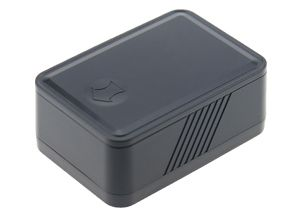

# AoYa - T19

The AoYa T19 is a magnetic mini GPS tracker designed for discreet and efficient tracking of vehicles, luggage, containers, and other valuable assets. Its compact form factor and strong magnetic base make it easy to attach to metal surfaces for covert placement, while the device is positioned as a versatile option for both short trips and long term monitoring needs.

As a Plaspy compatible device, the T19 can feed its location data into Plaspy for centralized visibility and operational oversight. Plaspy users can add the T19 to their asset lists to receive real time location updates, geofence alerts, and consolidated tracking history alongside other devices managed on the platform.

## Key Highlights

- Magnetic mini tracker built for discreet attachment to metal surfaces
- Designed for tracking vehicles, luggage, containers, and other assets
- Very long battery life advertised to support extended monitoring periods
- Real time tracking accessible via mobile and web platforms
- Geofence capability for instant entry and exit notifications
- Compact and portable form factor suitable for covert placement

## How It Works with Plaspy

When paired with Plaspy, the AoYa T19 provides continuous position updates and event notifications to Plaspy dashboards so teams can monitor assets within a single interface. Plaspy aggregates location data and presents it alongside other fleet and asset information to support operational decision making.

- Display real time location of T19 tracked assets on Plaspy maps
- Configure geofence alerts in Plaspy to be notified when assets move into or out of defined areas
- Monitor historical movement and travel history for auditing and reporting
- Combine T19 location data with other fleet information for consolidated oversight
- Receive status notifications in Plaspy to help prioritize follow up or recovery actions

## Typical Use Cases

- Covert vehicle tracking for recovery or oversight of high value assets
- Luggage monitoring during travel to confirm location and transit progress
- Container and cargo tracking during storage and intermodal transport
- Long term asset monitoring where infrequent maintenance of the tracker is preferred
- Temporary attachment for rental fleet oversight or short term deployments

## Why Choose This Tracker with Plaspy

The AoYa T19 is a practical option for organizations that need a low profile, battery efficient tracker that can be placed quickly on metal assets. Its long advertised battery life and magnetic mounting make it especially well suited to long term monitoring scenarios and situations where discreet placement matters. When used with Plaspy, the T19 adds a compact tracking source that integrates into a broader tracking and reporting workflow.

If you want centralized visibility for discreet or long duration asset tracking, pairing the AoYa T19 with Plaspy allows teams to view real time positions and geofence events alongside other devices in one platform. To learn more about Plaspy and how it can manage compatible trackers visit https://www.plaspy.com. Product specifications and availability can change over time, so please verify current details and technical documentation on the manufacturer website http://www.aoyagps.com/ before making deployment decisions.
