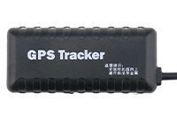

# AoYa - T2

The AoYa T2 is a compact vehicle GPS tracker designed for real time tracking and basic monitoring of cars and light vehicles. It combines a small form factor, roughly 72 x 32 x 15 mm, and a lightweight body of about 56 g, making it easy to place discreetly in a vehicle. The unit uses GSM GPRS connectivity alongside dedicated positioning hardware to deliver location information with reported sensitivity and typical accuracy suitable for routine vehicle tracking needs. An internal emergency battery provides limited backup power so the device can continue to report position if the main vehicle power is interrupted.

As a Plaspy compatible device, the AoYa T2 can feed location data into fleet and asset management workflows to support live tracking, historical playback, and operational visibility. Its compact size and backup battery make it a practical option for organizations that need unobtrusive tracking hardware that can continue to report during power events. When paired with Plaspy, the T2 helps deliver location awareness and simple monitoring capabilities without adding unnecessary complexity.

## Key Highlights

- Compact and discreet form factor suited for hidden installation in vehicles
- Lightweight design at approximately 56 g for easy placement
- GSM GPRS connectivity for continuous location reporting over cellular networks
- Dedicated positioning chipset and reported GPS sensitivity for consistent location fixes
- Typical location accuracy in the range of about 5 to 10 meters for general tracking
- Built in emergency battery with 42 mAh capacity to provide backup tracking if main power is lost

## How It Works with Plaspy

When connected to Plaspy, the AoYa T2 contributes continuous position updates and status information that Plaspy uses to present vehicle locations and motion history in a unified interface. Integration with Plaspy is focused on location visibility and operational oversight rather than device configuration details.

- Real time location display in the Plaspy dashboard for live monitoring of individual vehicles
- Historical route playback and trip timeline to review movements over a selected period
- Alerts and notifications based on position events and basic device status when configured in Plaspy
- Fleet level visibility to monitor multiple T2 units across vehicles from a single view
- Operational reporting to help track utilization and movement patterns for planning and oversight

## Typical Use Cases

- Fleet tracking for small commercial vehicle fleets and service vehicles
- Vehicle security and theft deterrence where a discreet tracker is beneficial
- Rental and shared vehicle monitoring to record location history and usage
- Personal vehicle tracking for location awareness and emergency backup tracking
- Lightweight asset monitoring for movable vehicle based equipment

## Why Choose This Tracker with Plaspy

The AoYa T2 is a practical choice for organizations and users who need a small, straightforward GPS tracker that provides reliable position reporting and a limited emergency power option. Its compact dimensions and modest weight make it easy to deploy without altering vehicle aesthetics, and the combination of cellular communication and a capable positioning chipset delivers the basic performance expected for routine vehicle tracking.

Paired with Plaspy, the T2 can be part of an accessible tracking solution that emphasizes visibility, historical review, and operational oversight rather than advanced telemetry. Because available specifications are concise, teams that require additional telemetry or specialized integrations should validate those needs against device documentation, but for many standard fleet and security scenarios the AoYa T2 offers a balanced, unobtrusive option.

To learn more about Plaspy and how compatible devices like the AoYa T2 can fit into your tracking workflow visit https://www.plaspy.com. Product specifications, availability, and manufacturer details can change over time, so please verify current technical information on the manufacturer site http://www.aoyagps.com/ before making procurement or deployment decisions.
