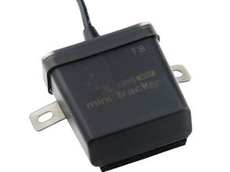

# AoYa - T8GPS

The AoYa T8GPS is a compact, automotive focused GPS tracker built for cars, trucks, and boats. It combines a waterproof IP67 enclosure with a small footprint and light weight, making it suitable for a variety of vehicle mounting scenarios. The device supports GPS, LBS, and AGPS positioning to provide real time location data, and its advertised accuracy of roughly 5 to 10 meters supports routine tracking and fleet oversight needs.

As a Plaspy compatible tracker, the T8GPS can feed its location data into Plaspy for centralized visibility and operational monitoring. Its wide input voltage range and built in emergency battery help maintain reporting continuity across different vehicle types, while the use of common GPS and cellular components makes it a practical choice for organizations seeking reliable position updates and basic event reporting within the Plaspy platform.

## Key Highlights

- Compact IP67 rated waterproof design suitable for cars trucks and boats
- GPS LBS and AGPS positioning for real time location tracking
- Small dimensions and low weight for flexible placement and deployment
- Wide input voltage range of 9V to 100V for compatibility across vehicle types
- Emergency backup battery to maintain operation during power loss
- Uses UBLOX GPS and SIMTK6260 GSM components as part of its location and communication hardware
- Advertised accuracy in the 5 to 10 meter range and high GPS sensitivity

## How It Works with Plaspy

When used with Plaspy, the T8GPS transmits its position and basic status information to Plaspy where that data is presented alongside other fleet assets. Plaspy ingests the incoming location stream and makes it available for live monitoring, history playback, alerting, and reporting, enabling practical fleet management workflows.

- Live location display and vehicle status overview within Plaspy dashboards
- Location history and route replay for trip review and incident analysis
- Geofencing and movement alerts to notify teams of important events
- Consolidated fleet views and reporting for operational insight and planning
- Continued tracking visibility during power interruptions using the emergency battery

## Typical Use Cases

- Commercial fleet vehicle tracking and route oversight
- Tracking of boats and marine assets in mixed weather conditions
- Rental car and vehicle pool monitoring for location and utilization
- Small to medium fleet operations requiring compact waterproof hardware
- Asset recovery and location verification for individual vehicles

## Why Choose This Tracker with Plaspy

The AoYa T8GPS is a practical option for organizations that need a compact waterproof tracker for everyday vehicle monitoring. Its combination of multiple positioning modes and a broad voltage range makes it well suited to diverse automotive environments, while the small form factor aids discreet installation where needed. Paired with Plaspy, the T8GPS contributes straightforward location data and basic continuity features that support common fleet management tasks without adding unnecessary complexity.

If you need an uncomplicated automotive tracker that integrates into a modern fleet platform, the T8GPS is worth considering. To learn more about how Plaspy can display and manage data from devices like the AoYa T8GPS visit https://www.plaspy.com. Product specifications and availability can change over time so verify current technical details on the manufacturer site http://www.aoyagps.com/ before making procurement decisions.
