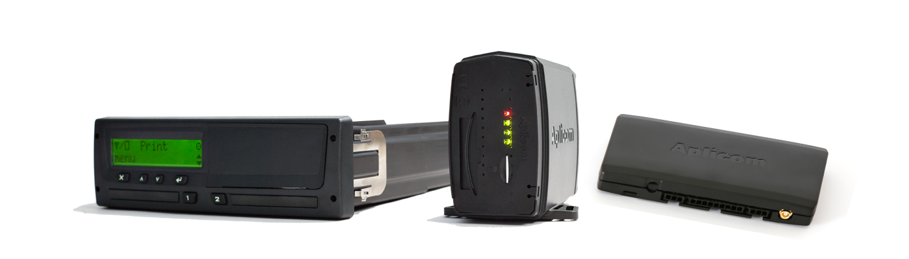

# Aplicom - A1 MAX RDL

The Aplicom A1 MAX RDL is a GPS tracker designed to support the Aplicom Remote Download RDL Service for digital tachograph data collection. In addition to its remote download capability, the device provides general telematics and tracking functionality, enabling location monitoring and fleet data collection without the need for physical access to vehicles. This combination makes the A1 MAX RDL suited to operations that require both compliance data and ongoing fleet visibility.

As a device compatible with Plaspy, the A1 MAX RDL can be integrated into a single fleet management environment where remote tachograph retrieval and telematics data coexist. That compatibility helps fleet managers consolidate tachograph downloads, location tracking, and operational reporting inside Plaspy, reducing manual workflows and improving access to timely vehicle and driver information.

## Key Highlights

- Remote download support for digital tachograph data via Aplicom RDL service
- Full telematics and tracking functionality alongside remote download features
- Enables remote collection of regulatory data without physical vehicle access
- Useful for fleets that need consolidated visibility of compliance and operations
- Designed to support continuous fleet monitoring and reporting workflows
- Flexible configuration of remote download functions to match operational needs

## How It Works with Plaspy

When used with Plaspy, the A1 MAX RDL provides both tachograph retrieval and vehicle telematics within the Plaspy platform, allowing teams to view and manage data from one place. Integration is focused on bringing remote download events and tracking information into Plaspy dashboards and reporting tools for easier operational oversight.

- Remote tachograph download events visible alongside tracking data in Plaspy
- Centralized logging of download timestamps and associated vehicle records
- Real time location monitoring and tracking history for operational analysis
- Fleet level reporting that combines compliance data and telematics summaries
- Alerts and notifications in Plaspy tied to remote download failures or status changes
- Use of configured schedules or triggers to collect tachograph data within Plaspy workflows

## Typical Use Cases

- Transport operators needing remote access to driver tachograph files for compliance
- Fleets that require combined telematics and tachograph visibility in one platform
- Companies reducing manual retrievals by centralizing data collection remotely
- Operators monitoring vehicle locations while maintaining regulatory records
- Organizations seeking improved operational reporting through integrated data

## Why Choose This Tracker with Plaspy

The Aplicom A1 MAX RDL is a practical choice for organizations that must manage both compliance data and daily fleet operations. Its remote download capability for tachographs pairs naturally with telematics features to provide a fuller operational picture. When connected to Plaspy, these capabilities help reduce manual processes and make compliance related data more accessible to fleet administrators.

Because information needs and regulatory requirements evolve, the A1 MAX RDL is best considered as part of a broader Plaspy deployment that aligns data collection, reporting, and monitoring. Plaspy provides the platform layer to bring remote download events and telematics data together, offering fleet teams a unified environment for oversight and decision making.

To learn more about using the A1 MAX RDL with Plaspy and to explore platform features, visit https://www.plaspy.com. Product specifications, availability, and manufacturer details can change over time, so please verify current technical information and service options on the Aplicom website https://www.aplicom.com/.
