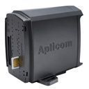

# Aplicom - A1 TRAX

The Aplicom A1 TRAX is a highly versatile GPS tracker designed for fleet and asset tracking as well as security applications. With its user-friendly interface and advanced software functionality, this unit offers precise GPS/GLONASS tracking, mileage reporting, power management, driver behavior monitoring, and data communications. Whether you need to track a fleet of vehicles or monitor the location and security of valuable assets, the A1 TRAX is equipped to handle the task.

One of the standout features of the A1 TRAX is its extensive memory capacity, which ensures smooth operation and allows for the expansion of features. Additionally, the unit boasts a highly reliable two-processor architecture, ensuring accurate and consistent performance. The A1 TRAX supports GPS/GLONASS positioning with A-GPS and Cell ID positioning, providing accurate location data even in challenging environments. It also comes equipped with GSM and GPS/GLONASS antennas for seamless communication.

With its versatile connections and interfaces, the A1 TRAX offers flexibility and adaptability. It features a 3D accelerometer for acceleration measurement, movement detection, and wake-up functionality. The unit also supports geofencing, allowing you to define custom geofences in various shapes \(circle, box, polygon\) and receive geofence in/out reports. Additionally, the A1 TRAX is Java programmable, offering the option to customize and enhance its functionality through the use of the SDK.

Overall, the Aplicom A1 TRAX is a reliable and feature-rich GPS tracker that is suitable for a wide range of tracking and security applications. Its ease of use, versatile connections, and expandable features make it an excellent choice for fleet management, asset tracking, and other tracking needs.

