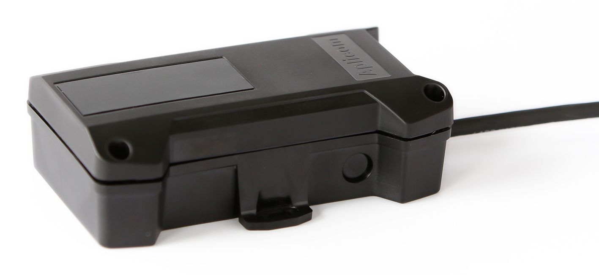

# Aplicom - A9 IPEX

The Aplicom A9 IPEX is a highly reliable and rugged GPS tracker designed to collect and communicate vehicle and asset information for a back-end service. It offers a cost-efficient solution for fleet owners and construction site managers to enhance fleet use, security, and productivity.

One of the standout features of the A9 IPEX is its IP67-level enclosure, which provides protection against dust and water. This ensures that the tracker can withstand harsh environmental conditions, making it suitable for use in various industries and applications.

In terms of connectivity, the A9 IPEX can connect to CAN-systems, such as the electronic braking system \(EBS\), allowing for seamless integration with existing vehicle systems. Additionally, it features a serial RS232 port, enabling reefer reading of Thermo King, Euroscan, and other cold chain units.

The A9 IPEX supports GPS/GLONASS positioning, ensuring accurate and reliable location tracking. It also incorporates A-GPS and Cell ID positioning for enhanced positioning capabilities. The unit is equipped with a 3D accelerometer, enabling acceleration measurement, movement detection, and wake-up functionality.

Furthermore, the A9 IPEX offers geofence support with different shapes for geofence definition, including circles, boxes, and polygons. This allows for precise geofence configuration and geofence in/out reporting, providing valuable insights into vehicle and asset movement.

With its robust construction, advanced features, and versatile connectivity options, the Aplicom A9 IPEX is an excellent choice for fleet management, asset tracking, and other applications where reliable and accurate GPS tracking is essential.

