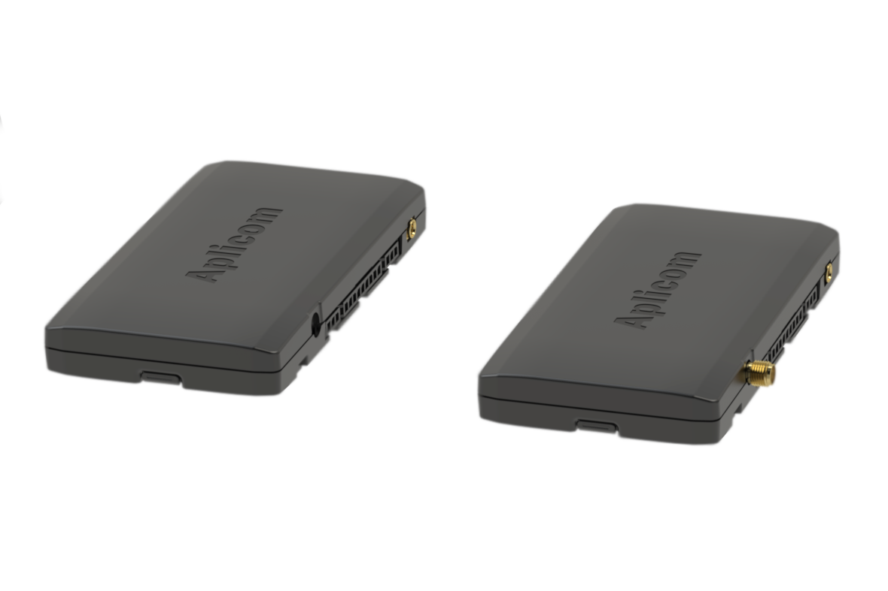

# Aplicom - A9 PRO

The Aplicom A9 PRO is a compact, rugged telematics unit designed for fleet management and telemetry applications that demand reliable GNSS positioning and broad vehicle integration options. Built on Aplicom’s A9 evolution platform, the A9 PRO pairs enhanced GNSS performance with a robust set of wired interfaces and motion sensing to support continuous location tracking and operational telemetry in commercial vehicle environments.

As a Plaspy compatible device, the A9 PRO can forward location, telemetry and event data into Plaspy’s monitoring and reporting workflows. Its developer oriented toolset and remote management features make it straightforward for integrators and fleet operators to incorporate A9 PRO devices into Plaspy for real time tracking, alerts and historical analysis without heavy custom development.

## Key Highlights

- Plaspy compatibility for real time tracking and fleet management via standard telematics flows and ADS REST API forwarding.
- 4G LTE connectivity and enhanced GNSS positioning for dependable location updates suitable for fleet operations.
- Built in accelerometer and RTC to provide motion events and accurate timestamping for trips and alarms.
- Expanded I/O and vehicle integration options including CAN bus and serial interfaces to capture vehicle telemetry where available.
- Compact, rugged form factor with support for internal and external antennas for flexible installation in vehicles and assets.
- Enterprise remote management including OTA updates and configuration via Aplicom tools to reduce field maintenance.
- Developer resources such as SDK and configuration tools to accelerate integration into platforms like Plaspy.

## How It Works with Plaspy

The A9 PRO delivers GNSS location, vehicle telemetry and I/O events into Plaspy’s ingestion pipeline so operators can monitor assets, trigger alerts and generate reports. Data from the device is forwarded through Aplicom’s data services or standard transport methods into Plaspy where it becomes available for real time dashboards, reporting and operational workflows.

- Continuous real time location updates for live fleet visibility and geofencing monitoring.
- Telemetry and vehicle bus data intake to surface key operational parameters in Plaspy dashboards and reports.
- Event driven alerts based on accelerometer movement, input triggers and configurable I/O conditions.
- Historical trip analytics and reporting for route review, utilization metrics and compliance records.
- Remote device configuration and lifecycle management to update settings and firmware without physical access.

## Typical Use Cases

- Commercial fleet tracking for route monitoring, dispatch coordination and asset visibility.
- Vehicle security and anti theft workflows using motion events and I/O triggered alarms.
- Trailer and asset telemetry including door status, pulse counted sensors and location reporting.
- Predictive maintenance support and diagnostics when vehicle bus data is available to supplement maintenance schedules.
- Scalable IoT telemetry projects where remote configuration and OTA management reduce maintenance overhead.

## Why Choose This Tracker with Plaspy

The Aplicom A9 PRO is a practical option for organizations that require a rugged, integration friendly telematics unit compatible with Plaspy. Its combination of reliable GNSS performance, cellular connectivity and a versatile I/O set delivers the core capabilities needed for real time tracking, event detection and vehicle data collection. For fleets and integrators, the A9 PRO’s remote management and developer tools help streamline deployment and ongoing maintenance when feeding telemetry into Plaspy.

If you want to learn more about how the A9 PRO can fit into your Plaspy deployment, visit Plaspy to explore platform features and integration options https://www.plaspy.com. Product specifications and availability can change over time, so please verify current technical details and compatibility on the manufacturer site https://www.aplicom.com/ before making procurement or integration decisions.
