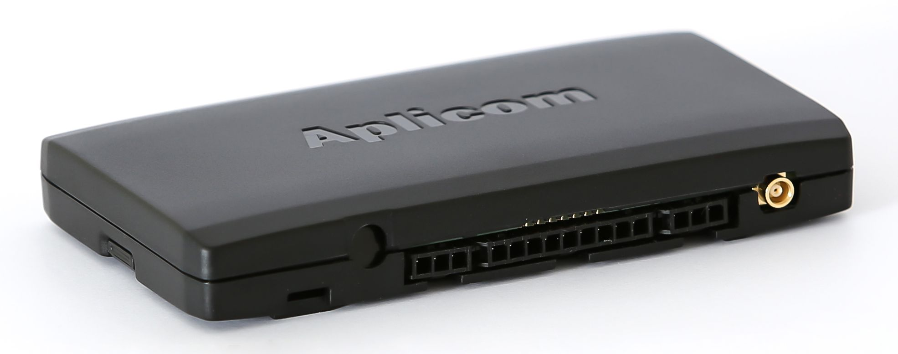

# Aplicom - A9 TRIX 3G

The Aplicom A9 TRIX 3G is a cutting-edge telematics unit that offers advanced features and reliable performance. With its support for 3G networks, the A9 TRIX automatically switches to the best available network \(GPRS, EDGE, UMTS, or HSPA\), ensuring seamless connectivity and high data transfer rates. With a downlink speed of up to 7.2 Mbps and an uplink speed of up to 5.7 Mbps, this unit is capable of handling large amounts of data efficiently.

One of the standout features of the A9 TRIX is its future-proof design. With support for both 2G and 3G networks, this unit is ideal for customers who want a long-term telematics solution. In countries where 2G networks are being phased out, the A9 TRIX ensures continued connectivity and functionality. Additionally, the A9 TRIX offers tachograph download capabilities, allowing users to access real-time data and signed official ddd-files.

The A9 TRIX boasts all the great features of Aplicom's A9 NEX product line, including a compact size, easy installation, and internal antennas for GPS/GLONASS and GPRS. The unit also features a highly reliable two-processor architecture, extensive memory capacity, and a back-up battery for uninterrupted operation. With its 3D accelerometer, the A9 TRIX can accurately measure acceleration, detect movement, and wake up when needed. The unit also supports geofencing, allowing users to define custom boundaries and receive notifications when vehicles enter or exit these areas.

With its advanced features, reliable performance, and future-proof design, the Aplicom A9 TRIX 3G is an excellent choice for businesses and individuals looking for a high-quality telematics unit.

### Key Features:

- 3G network support
- CAN interface with software options for CAN/FMS and CAN ID
- K-line for real-time tachograph data
- Extensive memory capacity
- Highly reliable two-processor architecture
- GPS/GLONASS positioning supported with A-GPS and Cell ID positioning
- Internal GSM and GPS/GLONASS antennas
- Back-up battery
- 3D Accelerometer based acceleration measurement, movement detection, and wake-up
- Serial port SW option
- Expandable unit features with available software options
- Geofence support with different shapes for geofence definition

