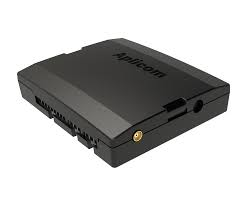

# Aplicom - T20

The Aplicom T20 is a compact GPS tracker and telematics gateway designed for reliable vehicle and mobile equipment tracking. Built to operate with LTE‑M cellular connectivity and industrial interfaces, the T20 collects location and telemetry data from mobile assets and supports peripherals commonly used in fleet and equipment monitoring workflows. It is positioned for integrators and fleet operators who need continuous tracking, telemetry capture and remote device management.

As a Plaspy compatible device, the T20 can forward processed location and telemetry data into Plaspy for mapping, alerts and fleet oversight. Integrators can use Aplicom tools to preprocess data at the edge and then stream relevant events to Plaspy, enabling efficient real‑time tracking and operational reporting while keeping device management and OTA updates coordinated across deployments.

## Key Highlights

- Compact telematics gateway for vehicle and mobile equipment tracking and monitoring
- LTE‑M cellular connectivity optimized for IoT and long term network support
- Dual CAN bus interfaces and industrial I O for direct capture of vehicle and machine telemetry
- Support for peripherals such as iButton readers, keypads, RFID readers and temperature sensors
- Aplicom SDK for on device edge processing to reduce data volume before cloud upload
- Silver Cloud OTA tools for remote configuration and firmware updates across fleets

## How It Works with Plaspy

The Aplicom T20 integrates with Plaspy by sending filtered location, telemetry and event data over the cellular link. Edge logic on the device can aggregate or suppress raw inputs so Plaspy receives only the most relevant information for monitoring, reporting and automated workflows. Within Plaspy, that data is used to provide visibility, alerts and historical reporting for fleet operations.

- Real time location and telemetry updates delivered to Plaspy for live fleet monitoring
- CAN bus and peripheral events forwarded as telemetry streams for diagnostics and asset state tracking
- Sensor and peripheral events used to trigger Plaspy alerts and workflow automations for cargo or access control
- Edge processed events reduce cellular usage so Plaspy receives condensed, actionable data for reporting
- Coordinated device management and update scheduling alongside Plaspy fleet administration

## Typical Use Cases

- Fleet tracking and route visibility for light and heavy vehicles with telemetry integration
- Heavy equipment monitoring and diagnostics to support maintenance planning
- Trailer and cargo monitoring using RFID and temperature inputs for logistics control
- Anti theft and immobilizer workflows combined with Plaspy alerts and remote actions
- Industrial IoT deployments where edge filtering and OTA management are required

## Why Choose This Tracker with Plaspy

The Aplicom T20 is a practical choice for organizations using Plaspy when they need a compact telematics gateway that supports robust telemetry inputs and remote management. Its combination of industrial I O, dual CAN capability and Aplicom management tools gives integrators options to implement edge logic, reduce cloud data volumes and maintain devices at scale.

If you want to learn more about how Plaspy works with compatible devices like the Aplicom T20, visit the Plaspy main website https://www.plaspy.com. Product specifications, availability and manufacturer details can change over time, so please verify current technical documentation and features on the Aplicom official site https://www.aplicom.com/ before planning large deployments.
