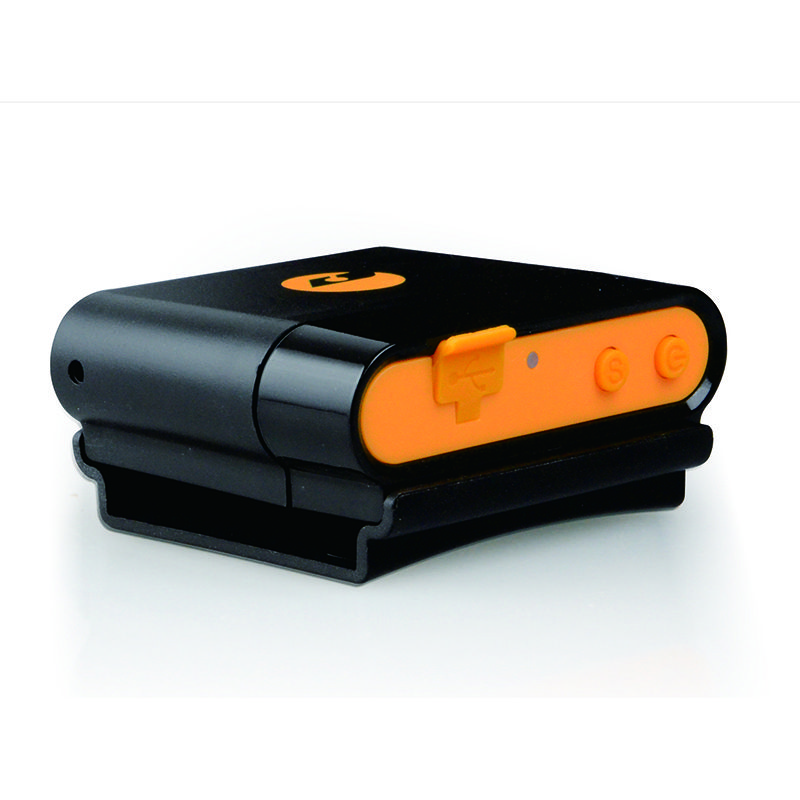

# Appello - Anywhere

The Appello Anywhere is a compact and versatile GPS tracker designed for reliable location tracking across a broad set of scenarios. It combines multi band GSM GPRS connectivity with a New Star NS 1315 GPS chip and an ARM 7 CPU to deliver positional data with reported sensitivity and accuracy suitable for mobile and portable tracking. The device package includes a wall charger and a rechargeable battery, and its small size and light weight make it convenient for vehicle, asset, or personal transport use.

As a Plaspy compatible device, the Anywhere provides the kind of steady location updates and device status information that Plaspy uses to deliver map visualization, fleet monitoring, alerts, and reporting. Plaspy can ingest the tracker feed to provide operational visibility, historical playback, and alerting workflows that help teams monitor assets and people in the field while keeping device management centralized.

## Key Highlights

- Multi band GSM GPRS compatibility for broad cellular coverage across 850 900 1800 and 1900 MHz bands
- New Star NS 1315 GPS chip and strong GPS sensitivity for improved positioning in challenging conditions
- Reported GPS accuracy around 5 meters for dependable location information
- Fast Time To First Fix with quoted cold and hot start performance to reduce initial lock time
- Compact footprint and light weight for easy placement and portability
- Rechargeable battery offering extended standby time suitable for intermittent or mobile use
- Wide operational and storage temperature range and high humidity tolerance for varied environments

## How It Works with Plaspy

Plaspy receives and processes the location and status updates sent by the Appello Anywhere and presents that information through maps, dashboards, alerts, and reports. The platform is designed to turn periodic device reports into actionable operational insight while keeping device visibility and historical context easy to access.

- Real time location display on Plaspy maps to monitor asset or vehicle positions
- Historical route playback and timeline views for trip review and incident analysis
- Geofence and movement alerts to notify of entry exit or unexpected motion
- Visibility of device reported status such as battery and connection state when available
- Reporting and export tools for fleet performance, utilization, and operational oversight

## Typical Use Cases

- Vehicle fleet tracking for small vehicles and service fleets
- Portable asset monitoring for rented equipment trailers and high value items
- Personnel tracking for field teams where a compact tracker is needed
- Short term logistics and delivery tracking to monitor routes and timings
- Field service operations that require location visibility and historical reporting

## Why Choose This Tracker with Plaspy

The Appello Anywhere is a practical choice when you need a small form factor tracker that still offers reliable GPS performance and broad cellular band support. Its sensitivity and quoted accuracy make it suitable for many on the move scenarios, while the quoted standby time and included charging accessory simplify deployment for temporary or mobile use cases. The rugged storage and operating ranges add resilience for outdoor and mixed environment use.

When paired with Plaspy, the Anywhere can feed location and status information into a centralized fleet management workflow. Plaspy complements the device by offering map centric tracking, alerts, historical playback, and reporting capabilities that help teams turn raw position data into operational insight. Based on the available specifications this combination is well suited to organizations needing compact portable tracking with platform level visibility.

To learn more about how the Appello Anywhere can work with Plaspy please visit https://www.plaspy.com. Product specifications availability and manufacturer details can change over time so verify current specifications on the official manufacturer site http://www.cnjeo.com/
