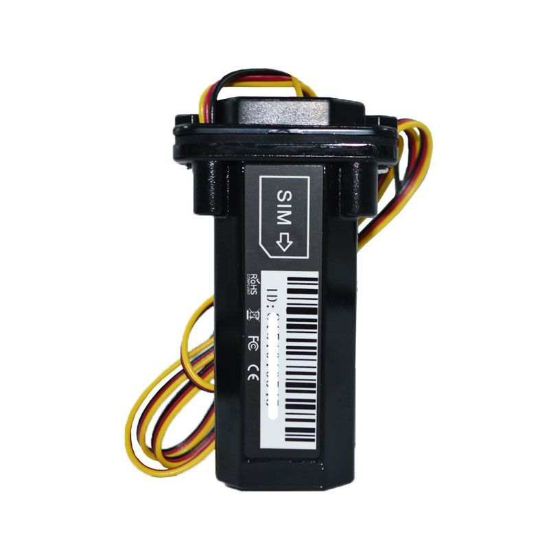

# Appello - GT01

The Appello GT01 is a compact and lightweight GPS tracker designed to provide accurate and reliable tracking for a variety of applications. With its dimensions of 90\*52\*20mm and a net weight of just 150g, it is easy to carry and install in different locations. Whether you need to track vehicles, assets, or even people, the GT01 is a versatile solution that can meet your tracking needs.

One of the standout features of the GT01 is its GSM module, which operates on the MTK 850/900/1800/1900Mhz frequency bands. This allows for seamless communication and tracking capabilities across different regions and countries. Additionally, the GPS module of the GT01 utilizes the U-blox 7020 chipset, which provides exceptional sensitivity and accuracy with a sensitivity of -162dBm. This ensures that you can track your assets with precision, even in challenging environments.

The GT01 is equipped with a 3.7v 350mA battery, which provides a reliable power source for extended tracking periods. Whether you need to track assets for a few hours or several days, the GT01 can deliver consistent performance. Furthermore, the GT01 is rated IP67 waterproof, making it suitable for outdoor use and ensuring that it can withstand exposure to water and dust.

Overall, the Appello GT01 is a reliable and versatile GPS tracker that offers exceptional tracking capabilities in a compact and lightweight design. With its advanced GSM and GPS modules, long-lasting battery, and waterproof construction, it is an ideal choice for various tracking applications.

