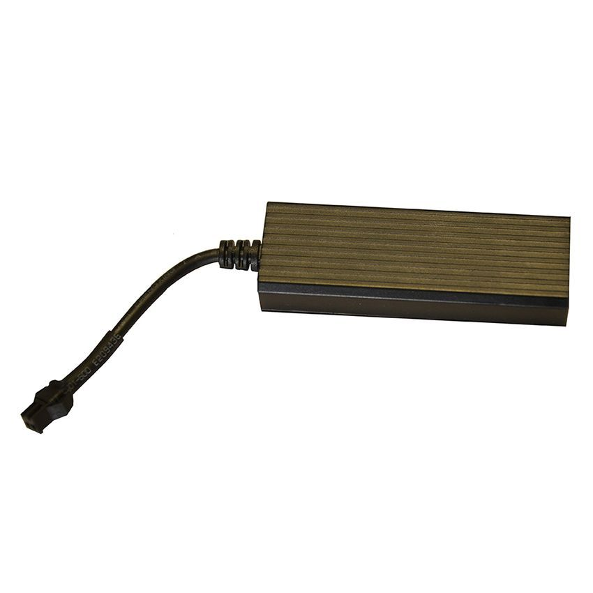

# Appello - GT07

The Appello GT07 is a compact GPS tracker designed specifically for motorcycles. It provides real time location tracking in a small, durable package and is built to operate across a wide working voltage range. The GT07 is positioned as a straightforward solution for monitoring motorcycle location and movement, with manufacturer stated GPS accuracy within 5 meters and a 12 month warranty.

As a device compatible with Plaspy, the GT07 can be used to bring motorcycle assets into Plaspy's visibility and reporting environment. Its form factor and accuracy make it a practical option for organizations and individuals who want motorcycle tracking integrated into a broader fleet or asset management workflow on the Plaspy platform.

## Key Highlights

- Compact and durable design tailored for motorcycle use
- Real time location tracking for continuous visibility
- GPS accuracy reported within approximately 5 meters
- Wide working voltage compatibility suitable for many motorcycle electrical systems
- 12 month warranty for added ownership assurance
- Suitable for single vehicles or small motorcycle fleets

## How It Works with Plaspy

When used with Plaspy, the GT07 provides position updates and event visibility that Plaspy can display, analyze, and include in operational workflows. Plaspy consolidates device locations with other assets so you can monitor motorcycles alongside cars, vans, or other tracked items.

- Real time location display on Plaspy maps for live monitoring
- Movement history and position replay for route review and incident investigation
- Alerts and notifications in Plaspy for motion or boundary events
- Grouping and tagging of motorcycle assets for organized fleet oversight
- Reporting and exportable location summaries for operational analysis

## Typical Use Cases

- Theft deterrence and recovery by maintaining continuous location visibility
- Monitoring delivery or courier motorcycles to improve route oversight
- Managing rental or shared motorcycle fleets with centralized tracking
- Personal motorcycle tracking for owners who want ongoing location awareness

## Why Choose This Tracker with Plaspy

The GT07 is a practical choice for organizations that need a compact tracker for motorcycles and want to integrate those assets into Plaspy. Its combination of real time tracking, modest size, and broad voltage compatibility means it fits common motorcycle environments while delivering location accuracy suitable for operational monitoring.

Because Plaspy is designed to unify location data from compatible devices, pairing the GT07 with Plaspy helps teams keep motorcycle assets visible alongside other fleet elements, run consolidated reports, and set up alerts that match their operational needs. If you need a focused motorcycle tracking device that works within a larger fleet platform, the GT07 with Plaspy is a viable option.

To learn more about Plaspy and how it can work with GPS trackers like the Appello GT07 visit https://www.plaspy.com. Product specifications, availability, and manufacturer details can change over time, so please verify current technical information on the manufacturer website http://www.cnjeo.com/.
