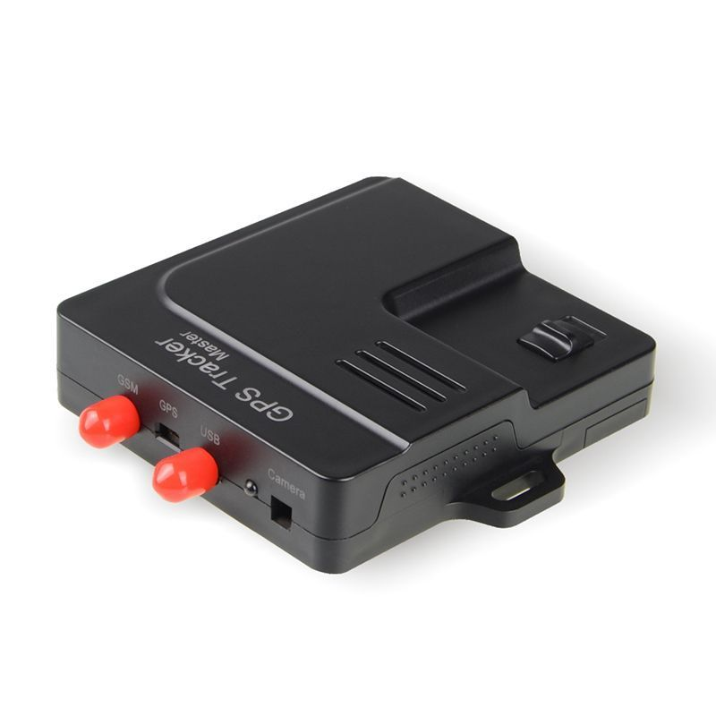

# Appello - Master

The Appello Master is a compact GPS tracker designed to provide accurate location tracking and continuous monitoring for vehicles and assets. At 85.00 x 78 x 20 mm and 93 g, the unit is small and lightweight for discreet placement. It combines an ARM7 CPU with the New Star NS-1315 GPS chip to deliver high sensitivity and a typical position accuracy of about 5 m, and it communicates over GSM GPRS bands for wide area coverage. The device includes an internal battery that supports standby operation and is specified for extended temperature and humidity ranges.

As a Plaspy compatible device, the Appello Master can feed live and historical location data into the Plaspy platform for fleet oversight and asset management. Its size, GPS sensitivity, and network support make it suitable for integration into tracking workflows that require reliable positioning and visibility. Plaspy users can add the Master to their device inventory to consolidate monitoring, alerts, and reporting across mixed fleets and equipment.

## Key Highlights

- Compact and lightweight form factor suitable for discreet vehicle and asset deployment
- High GPS sensitivity and reported position accuracy around 5 meters for reliable location fixes
- GSM GPRS support across common cellular bands for broad geographic coverage
- Built in battery provides standby tracking capability for temporary off power monitoring
- Wide operating and storage temperature ranges for use in varied environments
- Power input options that facilitate integration with a range of vehicle electrical systems

## How It Works with Plaspy

The Appello Master sends location and status information that Plaspy can ingest to provide real time visibility and historical playback. Within Plaspy the device appears alongside other trackers, enabling unified monitoring across an entire fleet or set of assets. Configuration inside Plaspy focuses on mapping, alert rules, reporting, and operational dashboards rather than device internals.

- Live location display and map visualization for vehicles and tracked items
- Historical route playback and event timelines for investigations and review
- Geofence and area alerts to notify teams when assets enter or exit defined zones
- Scheduled and on demand reports for utilization, movement, and compliance tracking
- Centralized device management to view status and basic connectivity indicators

## Typical Use Cases

- Fleet vehicle location tracking for dispatch and route monitoring
- Asset tracking of equipment that moves between sites or job locations
- Short term or emergency tracking using internal battery standby when external power is unavailable
- Rental and lease equipment monitoring to verify periods of use and location
- Field service vehicle oversight to improve routing and response coordination

## Why Choose This Tracker with Plaspy

Organizations that need a compact, resilient tracker for general purpose fleet and asset visibility may find the Appello Master a practical option when paired with Plaspy. Its reported GPS accuracy and cellular coverage characteristics support common tracking requirements, while the standby battery and environmental ratings make it adaptable for varied operational contexts. In Plaspy, the Master can contribute to a clear operational picture alongside other devices, simplifying oversight for mixed deployments.

Plaspy provides the software layer for dashboards, alerts, and reporting so teams can turn the Master device data into actionable insight. If you are evaluating trackers for integrated tracking and fleet management, the Appello Master is worth considering as a compatible device with Plaspy.

Learn more about Plaspy and how compatible trackers are used on the main website https://www.plaspy.com. Product specifications, availability, and manufacturer details can change over time, so please verify current technical information on the official manufacturer site http://www.cnjeo.com/.
