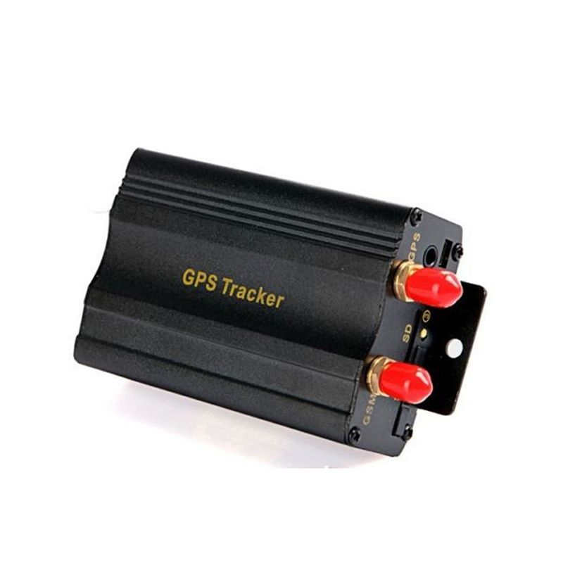

# Appello - TK103B

The Appello TK103B is a versatile GPS tracker designed to monitor vehicles, equipment, and people. It offers worldwide cellular connectivity and real time position reporting that can be viewed from computers, mobile phones, and mapping tools. The TK103B provides automatic periodic location updates, standard position fields such as latitude and longitude, speed and time, plus state checking and a range of configurable alerts to help maintain oversight of tracked assets.

As a Plaspy compatible device, the TK103B can feed location and alert data into Plaspy for unified fleet and asset management. Plaspy can display the tracker location on maps, surface event alerts, and include TK103B data in history and operational reports. For organizations already using Plaspy, the TK103B offers a familiar set of tracking features that integrate into common monitoring and reporting workflows.

## Key Highlights

- Worldwide cellular connectivity for remote location reporting and real time visibility
- Remote control functionality for flexible remote interactions with the device
- Automatic periodic tracking mode for scheduled position updates
- Standard location output including latitude, longitude, speed and timestamp
- Multiple alert types supported such as geo fencing, movement, over speed, SOS, and GPS off
- State checking for device conditions including GSM and GPS status and battery status

## How It Works with Plaspy

When connected to Plaspy, the TK103B supplies positional updates and event alerts that Plaspy presents on its mapping and monitoring interfaces. Plaspy centralizes incoming data from this tracker so operators can monitor locations, receive timely alerts, and analyze historical movements alongside other assets.

- Live location display on the Plaspy map for ongoing situational awareness
- Alert handling and notification routing for geo fence, over speed, movement, SOS, and similar events
- Historical track playback and reporting based on the tracker automatic update intervals
- Device state monitoring within Plaspy to show connectivity and basic health indicators
- Support for point to point, point to group, and group to group monitoring views for fleet operations

## Typical Use Cases

- Rental vehicle tracking and return management
- Monitoring outdoor machinery and construction equipment
- Personal safety and location sharing for individuals
- Fleet tracking for small and medium transport operations
- Asset loss prevention and security monitoring for high value items

## Why Choose This Tracker with Plaspy

The TK103B combines a practical feature set with straightforward data outputs that match common fleet and asset monitoring needs. Its remote control capability and configurable alerts make it suitable for organizations that require both routine position updates and on demand interactions. Paired with Plaspy, the tracker becomes part of a broader operational view that includes mapping, alerting, and historical reporting.

For teams evaluating GPS devices, the TK103B is worth considering where real time tracking, scheduled updates, and alerting are priorities and integration into Plaspy is desired. As with any equipment choice, confirm the device features and compatibility against your specific operational requirements.

To learn more about Plaspy and how it can work with devices like the Appello TK103B visit https://www.plaspy.com. Product specifications, availability, and manufacturer details may change over time, so please verify current technical information on the manufacturer website http://www.cnjeo.com/.
