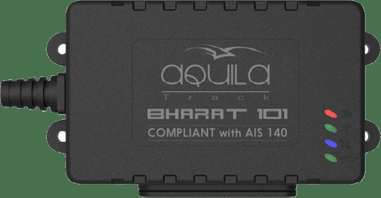

# Aquila - BHARAT 101

The BHARAT 101 is an AIS140 certified vehicle tracking and monitoring system by Aquila. It is the first Indian telematics company to receive this certification, making it a reliable and trusted choice for fleet management and tracking needs. This compact and ultra-high-end black box is ICAT certified and features a rugged IP67 casing, ensuring durability and protection against harsh environments.

With real-time tracking using GPS/Glonass technology, the BHARAT 101 provides accurate and up-to-date location information. It also offers solid-state storage with a capacity of 40,000 tracking records, allowing for extensive data collection and analysis. The tracker is equipped with 4 digital inputs, 2 digital outputs, 2 analog inputs, and a serial port \(RS232\), providing versatile connectivity options for various applications.

In addition, the BHARAT 101 features a 3-axis accelerometer and 3-axis gyrometer, enabling advanced motion sensing capabilities. It has a large battery backup of 700mAh, ensuring continuous operation even in the event of power loss. The tracker supports both normal and embedded SIM cards, offering flexibility in terms of connectivity options. It also has provision for IRNSS support, further enhancing its tracking capabilities.

The BHARAT 101 is housed in a rugged and environment-proof ABS casing with an IP67 rating, making it suitable for installation in challenging conditions. Its compact size allows for easy handling and installation, and it is designed for hidden or stealth installations with internal antennas. With its AIS-140 certification, this tracker meets the standards set by the Ministry of Road Transport and Highways, making it a reliable and compliant choice for various domains such as logistics, taxi operations, security tracking, and asset tracking.

### Key Features:

- AIS140 certified vehicle tracking and monitoring system
- Real-time tracking with GPS/Glonass
- Solid-state storage with 40,000 tracking records
- 4 digital inputs, 2 digital outputs, 2 analog inputs
- Serial port \(RS232\)
- 3-axis accelerometer and 3-axis gyrometer
- Large battery backup of 700mAh
- Supports normal and embedded SIM
- Provision for IRNSS support
- Rugged and environment-proof ABS casing with IP67
- ICAT certified

