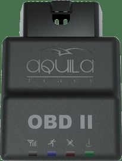

# Aquila - OBD II

The Aquila OBD II is a plug and play vehicle tracker that combines GPS location tracking with onboard vehicle diagnostics. Designed to connect to a vehicle diagnostic port, it captures vehicle parameters and diagnostic information and transmits that data to a central server for processing. The unit includes a motion sensor with a 3-axis accelerometer, internal GSM and GPS antennas, and a durable ABS plastic housing for everyday automotive use.

As a Plaspy compatible device, the Aquila OBD II brings both position visibility and vehicle data into the Plaspy platform for monitoring and reporting. Its ability to deliver real time location plus diagnostic parameters makes it useful for fleet operators and automotive service providers who want consolidated tracking, events, and vehicle health information visible inside Plaspy dashboards and reports.

## Key Highlights

- Combines GPS location tracking with onboard vehicle diagnostic data for unified visibility
- Motion detection via a 3-axis accelerometer to support movement and event awareness
- Reads standard and some manufacturer specific vehicle parameters for broader coverage
- Internal GSM and GPS antennas housed in a durable ABS plastic case for reliable operation
- Power failure detection and over the air configuration to support remote management
- Compact plug and play design suited for quick deployment across vehicle fleets

## How It Works with Plaspy

When used with Plaspy, the Aquila OBD II streams both location updates and vehicle parameter data to the Plaspy platform, enabling consolidated fleet oversight and operational reporting. Plaspy ingests the device data so administrators can view position, movement events, and diagnostic indicators alongside other fleet telemetry.

- Real time vehicle location and movement visibility within Plaspy maps and dashboards
- Event monitoring such as motion starts and stops driven by the accelerometer data
- Aggregated reporting that combines positional history with vehicle parameter logs
- Alerts and notifications based on diagnostic indicators or power failure detection
- Remote configuration options managed through the device and coordinated via Plaspy for operational adjustments

## Typical Use Cases

- Fleet management teams tracking vehicle location and usage for operations
- Service providers monitoring basic vehicle diagnostics and battery voltage trends
- Rental and shared vehicle programs needing plug and play tracking and status reporting
- Businesses combining location data with event alerts to improve dispatch and response
- Operators seeking consolidated reporting for both movement and vehicle parameter history

## Why Choose This Tracker with Plaspy

The Aquila OBD II is a practical choice for organizations that want location tracking paired with vehicle parameter visibility without a complex installation process. Its plug and play nature, motion sensing, and support for a range of vehicle parameters make it suitable for mixed fleets and business environments where both tracking and basic diagnostics are valuable.

For teams using Plaspy, this device can extend platform capabilities by supplying diagnostic context alongside GPS position data, helping with operational decisions, maintenance planning, and fleet oversight. The combination is particularly useful where quick deployment and consolidated monitoring are priorities.

Learn more about Plaspy and how compatible devices like the Aquila OBD II can support fleet visibility at https://www.plaspy.com. Product specifications, availability, and manufacturer details may change over time, so please verify current technical information and compatibility with the manufacturer at https://www.itriangle.in/.
