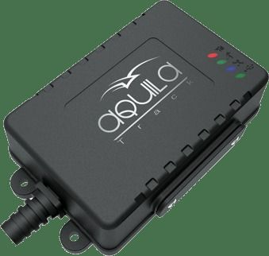

# Aquila - TS101 Advanced

The Aquila TS101 Advanced is a compact, rugged GPS tracking device designed for both basic and advanced tracking needs. It combines real time location reporting with onboard solid state storage capable of holding up to 16,000 tracking records, making it suitable for continuous monitoring and historical playback. The unit features a robust IP67 rated casing and ABS construction to withstand challenging environments, and it includes practical I O options such as a vehicle immobilizer, hooter interface, and a fuel sensor interface. An integrated 3 axis accelerometer adds motion detection and impact sensing to the device profile, while a 700mAH battery backup supports operation during power interruptions.

As a Plaspy compatible device, the TS101 Advanced can be integrated into fleet and asset management workflows to provide live visibility and historical insights. When connected to Plaspy, the tracker’s real time updates and stored records support location monitoring, operational oversight, and event based reporting. The combination of rugged construction, storage capacity, and I O functionality makes the TS101 Advanced a practical choice for organizations looking to pair a durable hardware platform with Plaspy’s tracking and monitoring tools.

## Key Highlights

- Real time location tracking for continuous visibility of vehicles and assets
- Onboard solid state storage holding up to 16,000 tracking records for historical data access
- Rugged IP67 rated ABS casing designed for harsh environments
- Practical I O features including vehicle immobilizer, hooter interface, and fuel sensor interface
- Integrated 3 axis accelerometer for motion detection and impact awareness
- Built in battery backup of 700mAH for continued operation during power loss

## How It Works with Plaspy

When used with Plaspy, the TS101 Advanced provides both live and historical location information to support fleet monitoring and operational decision making. Plaspy can display incoming position updates, use stored records for route reconstruction, and incorporate device events into alerts and reports.

- Live position updates appear on Plaspy maps for real time tracking and dispatch visibility
- Historical records from the device enable route playback and retrospective analysis
- Device inputs such as the accelerometer and I O events can be surfaced as alerts within Plaspy for impact or motion notifications
- Immobilizer and other control inputs can be represented in the platform to support operational actions and workflows
- Fuel sensor interface data can be used to enrich reporting and help monitor consumption trends

## Typical Use Cases

- Fleet logistics and route monitoring for delivery and transport operations
- Taxi and ride services requiring continuous location visibility and trip history
- Rent a car operations for vehicle tracking and usage oversight
- Security tracking for patrol vehicles and high value assets
- Insurance telematics programs that leverage historical records and event data
- General asset tracking where rugged, environment proof hardware is required

## Why Choose This Tracker with Plaspy

The TS101 Advanced is a practical fit for organizations that need a balance of durability, data retention, and input/output flexibility. Its rugged design and solid state storage make it reliable for field use, while motion detection and I O capabilities add operational context that teams can act on through Plaspy. For mixed fleets and asset portfolios, the device supports both real time monitoring and retrospective analysis, helping operators maintain oversight even when connectivity is intermittent.

Choosing the TS101 Advanced alongside Plaspy enables teams to combine resilient hardware with a software platform built for visibility, reporting, and fleet oversight. The result is a usable solution for common tracking scenarios without relying on complex or highly specialized equipment.

To learn more about Plaspy and how it can work with the Aquila TS101 Advanced, visit https://www.plaspy.com. Please note that product specifications, availability, and manufacturer details can change over time; verify current technical specifications and compatibility with the manufacturer documentation at https://www.itriangle.in/.
