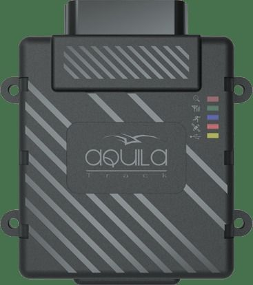

# Aquila - UX101

The Aquila UX101 is an advanced vehicle tracking device designed for fleet management and asset monitoring. It combines a compact, rugged IP67 rated enclosure with an automotive ECU type connector and internal GPS and GSM antennas to support concealed installations and stable connections in vehicle environments. The UX101 records key parameters such as location, time, speed, distance, and ignition status, and includes a motion sensor, a mains battery removal alert, voice capability, and on device data storage and forward architecture.

As a Plaspy compatible device, the UX101 can be integrated into Plaspy's fleet monitoring platform to provide real time visibility and operational oversight. Its flexible inputs and outputs, configurable tracking interval, and built in backup battery make it suitable for scenarios where persistent tracking, alerts, and offline data forwarding are important. Plaspy can use the telemetry the UX101 provides to power maps, alerts, and reports that help manage vehicles and assets more effectively.

## Key Highlights

- Rugged IP67 casing for protection in demanding vehicle and outdoor environments
- Automotive ECU type connector for stable mounting and reliable electrical connection
- Internal GPS and GSM antennas suitable for hidden or stealth installations
- Flexible I O options including RS232, CAN alternatives, USB port, analog and digital inputs and outputs
- Built in 700 mAh battery offering up to 8 hours of backup tracking
- Motion sensor and mains battery removal alert for enhanced security and tamper detection
- On device data storage with data forward architecture and support for integration via SDK

## How It Works with Plaspy

When paired with Plaspy, the UX101 delivers location and status data to the platform where it can be visualized, analyzed, and acted upon. Plaspy ingests the device data to provide fleet level views, configurable alerts, and historical reporting that support day to day operations and long term analysis.

- Live location and movement visibility on Plaspy maps for fleet monitoring
- Event and status reporting such as ignition, motion, and battery removal alerts
- Historical routes, speed, and distance reporting for compliance and performance review
- Offline data storage and forward behavior helps preserve records during connectivity gaps
- Configurable tracking intervals allow balancing between update frequency and power use
- SDK and integration options facilitate device provisioning and custom data mapping with Plaspy

## Typical Use Cases

- Commercial fleet tracking for delivery, service, and transport vehicles
- Logistics and route monitoring to improve routing and on time performance
- Security tracking for valuable vehicles and assets requiring tamper alerts
- Hidden or discreet installations where internal antennas and compact casing are preferred
- Mixed fleets needing flexible I O for connection to vehicle systems and external devices

## Why Choose This Tracker with Plaspy

The UX101 is a practical choice for organizations that need a rugged, flexible tracker that can be incorporated into a centralized fleet platform like Plaspy. Its combination of environmental protection, a secure vehicle connector, diverse I O options, and local data storage makes it adaptable to a range of vehicle and asset tracking scenarios. Paired with Plaspy, the device data becomes actionable through maps, alerts, and reports that support operational decisions.

Because the UX101 includes features for concealed fitting, backup power, and tamper alerts, it is well suited to deployments where continuous visibility and resilience matter. Plaspy's monitoring and reporting capabilities can leverage those features to improve uptime, security, and fleet efficiency while providing a single pane of glass for day to day management.

To learn more about how the UX101 can work with Plaspy, visit https://www.plaspy.com. Product specifications, availability, and manufacturer details can change over time, so please verify current technical specifications and support information on the manufacturer's official website https://www.itriangle.in/.
