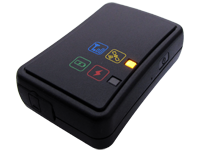

# ArkNav - AT-04

The AT-04 Compact GPS Tracker is a Plaspy compatible, ultra-small tracking device designed for discreet protection of children, high-value deliveries, and portable assets. Its compact, easy-to-hide form factor and single-button design reduce user error and false alarms, while built-in GPS, AGPS assistance and cell-location features help maintain reliable position reporting even where GPS alone struggles. With Plaspy integration, AT-04 is an ideal GPS tracker for deployments that need dependable location updates, low-power operation, and simple field management.

Engineered for long battery life and straightforward operation, the AT-04 supports timer and movement-activated reporting profiles and offers call/SMS location requests for rapid situational awareness. Plaspy-compatible setups can ingest the device’s location and motion data for real-time tracking, alerts, and historical reporting — making the AT-04 suitable for asset tracking, child protection, high-value package delivery, and light fleet or route-based monitoring where compactness and battery endurance are priorities.

## Key Highlights

- Plaspy compatible GPS tracker: integrates compact, location-focused reporting into Plaspy dashboards and alerting workflows.
- Ultra-small, easy-to-hide form factor tailored for covert tracking of assets, deliveries, and personal protection.
- Long battery life with a 1000 mAh internal battery and configurable timer/movement reporting — up to 14–15 days in timer mode.
- AGPS and cell-based location assistance to improve acquisition and indoor performance where pure GPS is limited.
- Simple user interaction via single-button design and call/SMS location requests that return Google Maps links for fast viewing on phones.
- On-device backup storage \(8 MB flash\) and motion detection from a 3-axis accelerometer for reliable event reporting.
- Full-size SIM slot and Prolific USB-to-Serial programming port for easy provisioning and configuration in the field.

## How It Works with Plaspy

When integrated with Plaspy, the AT-04 provides timely location and motion data that Plaspy can display, alert on, and use in telemetry workflows. The device’s flexible reporting modes allow installers to balance update frequency and battery life: Plaspy can present real-time position feeds when frequent reporting is enabled, or conserve power by ingesting less-frequent timer or movement-triggered updates. For deployments that rely on simple, robust connectivity, AT-04’s SMS and call-to-request features offer an alternative path to location data alongside any supported server upload methods documented by the manufacturer.

- Real-time location and telemetry updates \(subject to configured reporting interval and battery profile\).
- Movement detection and tamper events via the onboard 3-axis accelerometer \(±16G default\).
- Timer-activated and movement-activated reporting modes to extend battery life for long-term asset tracking.
- Call/SMS location requests that return Google Maps hyperlinks for quick mobile viewing and verification.
- Local backup storage \(8 MB flash\) to preserve recent fixes if connectivity is intermittent.

## Technical Overview

| Connectivity | GPS and GSM with AGPS assistance and cell-location support \(GSM-based reporting and SMS\). |
| --- | --- |
| Bands | Not specified in the supplied description — consult the manufacturer datasheet for supported GSM bands and regional variants. |
| Power & Battery | Built-in 1000 mAh rechargeable battery; configurable reporting profiles and power management; up to ~14–15 days in timer-activation mode \(depending on settings\). |
| Interfaces | Full-size SIM slot; Prolific USB-to-Serial programming port for configuration and provisioning. |
| GNSS | GPS with AGPS assistance and cell-based location for improved performance in indoor or weak-signal environments. |
| Sensors & Storage | 3-axis accelerometer \(±16G default\) for motion detection; 8 MB flash for backup storage of location/telemetry data. |
| Antennas | Built-in GPS and GSM antennas \(internal designs for compact form factor\). |
| Reporting Modes | Timer activation, movement activation, and manual call/SMS location requests; configurable reporting intervals. |
| Remote Management | Local configuration via USB-to-serial programming port \(Prolific\); consult manufacturer documentation for supported server upload or remote provisioning options. |
| Form Factor & Accessories | Ultra-compact, easy-to-hide tracker; standard travel charger and USB-to-serial programming cable included; optional lanyard available. |

## Use Cases

- High-value package and cash delivery — discreet tracking and location confirmation with long standby between charges.
- Asset tracking and management for portable equipment, tool sets, or inventory items that require covert monitoring.
- Child protection and personal safety — compact form, simple single-button operation, and quick-call location requests for caregivers.
- Covert surveillance and short-term field operations where size, battery endurance, and indoor position assistance matter.
- Small-route delivery or courier operations that need compact GPS trackers integrated into Plaspy for centralized monitoring.

## Why Choose This Tracker with Plaspy

Pairing the AT-04 with Plaspy gives organizations and individuals a compact, low-maintenance GPS tracker they can trust for discreet asset protection and straightforward monitoring. The device’s long battery life, configurable reporting profiles, and AGPS/cell-location assistance reduce the need for frequent maintenance while improving indoor reliability — an important advantage for child protection, high-value deliveries, and asset security. Plaspy’s platform then takes those location and motion feeds and turns them into actionable insights, alerts, and history for operators and managers.

If your deployment requires expanded vehicle telemetry such as fuel monitoring, ignition status, or immobilizer control, the AT-04’s design focuses on compact asset and personal tracking rather than vehicle I/O. In those cases, you can integrate AT-04 location and motion data into Plaspy alongside other Plaspy-compatible devices that provide dedicated fuel, ignition, or immobilizer telemetry. For environments that require Bluetooth sensors or additional environmental monitoring, verify available accessories and integration approaches in the manufacturer datasheet or consider combining AT-04 with complementary Plaspy-compatible sensors.

