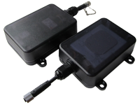

# ArkNav - AT-9000

The AT-9000 is a long operation GPS tracker designed for harsh environments and extended deployments. Built with a rugged waterproof and heatproof enclosure, it is optimized for container, trailer and heavy equipment tracking where external power is unavailable or intermittent. The device emphasizes durability and autonomy, making it suitable for long term asset visibility and reduced maintenance cycles.

As a Plaspy compatible tracker, the AT-9000 brings location and movement telemetry into Plaspy workflows for monitoring, alerts and historical reporting. Its configurable reporting profiles, AGPS with cell based fallback, movement detection and remote retrieval options make it a practical choice for teams using Plaspy to manage distributed assets with minimal onsite intervention.

## Key Highlights

- Long battery autonomy with a swappable rechargeable pack and quoted operation up to 120 days in timer activation mode.
- Rugged weatherproof construction with IP67 rated housing and heatproof casing for demanding outdoor deployments.
- Hybrid positioning using AGPS plus cell based fallback to improve location availability when GPS signals are weak.
- Movement detection via a built in 3 axis accelerometer to capture events and conserve battery with smart activation.
- Remote on demand location retrieval through SMS replies with map links and phone call response for quick checks.
- Local data resilience with onboard flash memory to store telemetry during coverage gaps for later upload.
- Field configurable with a full size SIM slot and USB to serial configuration interface for profile updates.

## How It Works with Plaspy

When deployed with Plaspy, the AT-9000 reports position and movement events according to configurable profiles so operators can balance visibility and battery life. Plaspy ingests the device telemetry for live tracking, alerting and reporting, and retains historical data for playback and analysis.

- Real time location and periodic telemetry uploads are processed by Plaspy for fleet visualization and status dashboards.
- Movement events from the accelerometer can trigger immediate alerts or wake the device for a position capture to support anti theft monitoring.
- Cell based location fallback provides position estimates that Plaspy can use when GPS reception is limited, improving continuity of tracking.
- SMS and phone call retrieval offer on demand checks that complement Plaspy reporting when immediate location is required.
- Local flash backup ensures telemetry is retained during outages and is uploaded to Plaspy once connectivity returns.

## Typical Use Cases

- Container and trailer tracking in ports yards and long haul scenarios where external power is not guaranteed.
- Heavy equipment monitoring for location visibility and movement detection on sites without permanent wiring.
- Dumpster and asset management where periodic reporting reduces maintenance while preserving route and usage history.
- Remote asset security for caravans portable equipment and outdoor assets exposed to weather and temperature extremes.
- POS or portable device continuity monitoring where local storage helps maintain telemetry through coverage gaps.

## Why Choose This Tracker with Plaspy

The AT-9000 is suited to organizations that need durable long life asset trackers integrated into a fleet management platform. Its combination of long battery runtime, rugged enclosure and hybrid positioning increases the chances of maintaining useful location data in challenging conditions. Configurable reporting and movement based activation help minimize maintenance and operational cost for large scale deployments.

If you want to learn more about how this tracker can fit into your Plaspy deployment visit https://www.plaspy.com. Product specifications availability and manufacturer details can change over time so please verify current device specifications and documentation on the manufacturer site https://www.arknavgps.com.tw/ before procurement.
