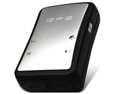

# ArkNav - K-18U

The ArkNav K-18U is a compact GPS data logger designed to record journeys and track assets with a focus on straightforward data capture. It logs time, date, and satellite location at one second intervals and stores complete GPS NMEA sentences so recorded tracks can be reviewed or processed later. The device saves data to removable micro SD storage and organizes files in chronological order for easy retrieval.

As a Plaspy compatible device, the K-18U is relevant for organizations that need reliable position history and flexible data handling. Its ability to produce full NMEA logs and the included K-18S test software make it a cost effective option for teams that want to combine local logging with Plaspy's mapping, reporting, and operational oversight. Plaspy can use the exported logs and position data from the K-18U to improve visibility into trips, assets, and fleet activity.

## Key Highlights

- Records time stamped GPS positions every second for detailed trip reconstruction
- Stores full GPS NMEA sentences for flexible post processing and analysis
- Uses removable micro SD cards for large or effectively unlimited storage capacity
- No driver installation required to access saved log files as a removable drive
- Configurable motion sensitivity and logging intervals to suit different use cases
- Includes K-18S tracking log management software as a cost effective testing option
- Automatic file organization in chronological order for straightforward data management

## How It Works with Plaspy

The K-18U provides precise logged location data that can be incorporated into Plaspy workflows to enhance visibility and historical analysis. Plaspy users can bring K-18U data into the platform or use exported logs alongside Plaspy tools to gain operational insights.

- Import or upload recorded NMEA log files into Plaspy for mapping and trip review
- Reconstruct journeys within Plaspy to analyze routes, stops, and timing
- Use logged positions to populate reports and exportable records for audits
- Combine logged data with Plaspy monitoring to improve fleet oversight and planning
- Leverage configurable logging intervals to balance detail and storage when preparing data for Plaspy

## Typical Use Cases

- Recording vehicle or equipment journeys for post trip analysis
- Keeping an auditable position history for company assets and shipments
- Monitoring employee travel patterns where local logging is preferred
- Collecting detailed route data for route optimization or compliance review
- Archiving GPS tracks for incident reconstruction or record keeping

## Why Choose This Tracker with Plaspy

The K-18U is a practical choice for organizations that need dependable local logging and straightforward file access. Its support for standard NMEA sentences and removable storage means data can be reviewed independently and also fed into Plaspy to extend visibility and reporting capabilities. For teams that prioritize cost effectiveness and simple data workflows, the K-18U pairs well with Plaspy's mapping and fleet management features.

Overall, the ArkNav K-18U offers a clear, log first approach to capturing movement data that complements Plaspy's operational tools. To learn more about how Plaspy can use logged GPS data and improve fleet and asset oversight visit https://www.plaspy.com. Product specifications and availability can change over time, so please verify current technical details and manufacturer support on ArkNav's official site at https://www.arknavgps.com.tw/ before making procurement or deployment decisions.
