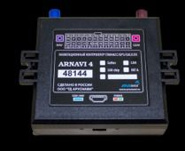

# Arusnavi - Arnavi

The Arusnavi Arnavi is a versatile navigation controller designed for remote monitoring of mobile objects. It is compatible with any compatible software package, making it easy to integrate into existing tracking systems. Whether you need to monitor the condition of a car or the equipment installed on it, the Arnavi has you covered.

One of the standout features of the Arnavi is its ability to connect to a wide range of sensors. With digital, discrete, analog, and frequency-pulse sensor support, you can monitor various aspects of your vehicle or equipment. This allows you to gather valuable data and make informed decisions based on real-time information.

In addition, the Arnavi supports the CAN bus, which is commonly used in modern vehicles. This enables seamless integration with the vehicle's onboard systems, providing even more detailed information and control options.

With its robust features and compatibility, the Arusnavi Arnavi is an excellent choice for anyone in need of a reliable and flexible navigation controller for remote monitoring. Whether you're tracking a fleet of vehicles or monitoring equipment in the field, the Arnavi has the capabilities to meet your needs.

