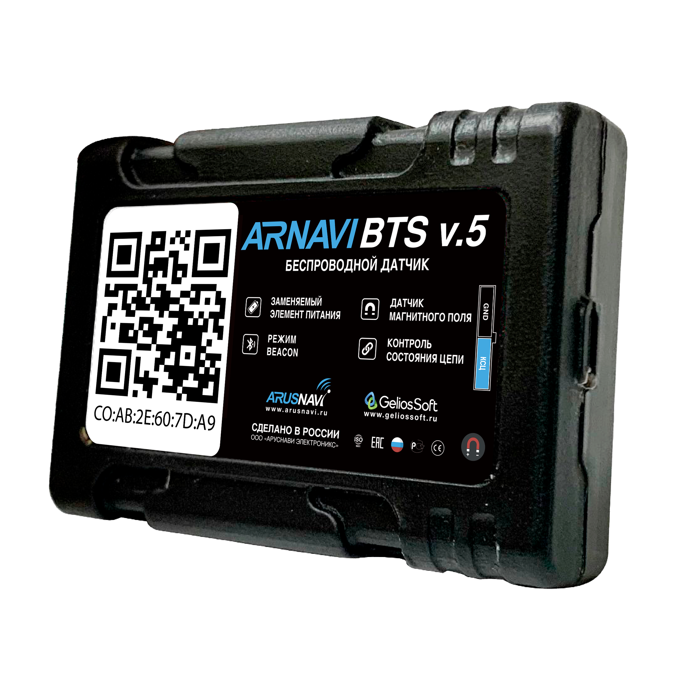

# Arusnavi - Arnavi BTS v.5

The Arnavi BTS v.5 is a compact Bluetooth Low Energy sensor and iBeacon tag designed for temperature monitoring, contact or door state detection, and asset identification. Its small form factor, configurable advertising parameters, and replaceable battery make it suitable for mounting on vehicles, containers, or fixed installations where simple environmental and proximity telemetry is required.

As a Plaspy compatible device when used with a Plaspy supported BLE gateway or alongside Plaspy GPS trackers, the BTS v.5 brings high frequency temperature and state data into fleet monitoring workflows. Integrating its beacon identity and sensor events into Plaspy enables combined visibility of environmental telemetry and vehicle location or asset context within a single fleet management platform.

## Key Highlights

- BLE sensor and iBeacon tag for temperature, contact state, and asset identity
- Plaspy compatible via a Plaspy supported BLE gateway or paired gateways
- Replaceable CR2477 battery for extended operational life and low maintenance
- Configurable transmission interval and radio power to balance responsiveness and battery life
- Compact and lightweight for discreet mounting on vehicles, containers, or equipment
- Beacon identity fields enable asset tagging using UUID MAJOR and MINOR values

## How It Works with Plaspy

When a Plaspy compatible BLE gateway or vehicle gateway collects the Arnavi BTS v.5 advertising packets, Plaspy ingests the sensor telemetry and beacon identity and maps it to the relevant asset or vehicle record. This allows environmental readings and discrete events to appear alongside GPS location and other fleet data inside Plaspy dashboards, alerts, and reports.

- Real time telemetry forwarding of temperature readings into Plaspy for live monitoring and threshold alerts
- Asset tagging using beacon identity so Plaspy can associate a specific tag with a pallet, compartment, or device
- Contact or door open close events are sent as discrete signals for anti tamper and security workflows
- Adjustable reporting behavior allows operators to control how often data arrives in Plaspy
- Works complementarily with Plaspy GPS trackers and gateways to provide location context for sensor data

## Typical Use Cases

- Cold chain logistics monitoring where temperature telemetry must be logged and alerted within fleet workflows
- Vehicle refrigerator monitoring paired with vehicle location data for compliance reporting
- Anti tamper and door monitoring to trigger immediate alerts on unauthorized openings
- Asset identification and proximity based tracking of pallets, containers, or equipment
- Simple equipment state monitoring using a circuit input for events sent into Plaspy

## Why Choose This Tracker with Plaspy

The Arnavi BTS v.5 is a sensor tag rather than a standalone GPS tracker, but it is a practical complement to Plaspy for organizations that need environmental telemetry and asset identity tied into fleet operations. Its long lived battery, configurable reporting, and iBeacon style identity fields make it easy to add temperature and contact sensing to an existing Plaspy deployment without heavy maintenance overhead.

For fleets and operators focused on cold chain integrity, anti tamper monitoring, or lightweight asset tracking, combining the BTS v.5 with Plaspy gateways and GPS units provides a cohesive view of location plus condition. If you need to learn more about how Plaspy supports BLE sensors and fleet telemetry, visit https://www.plaspy.com. Product specifications, availability, and manufacturer documentation can change over time, so please verify current details on the manufacturer site https://www.arusnavi.ru.
