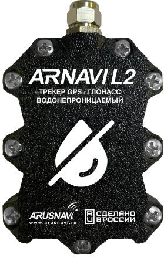

# Arusnavi - Arnavi L2

The Arnavi L2 is a compact, hermetically sealed GPS tracker designed for reliable real time tracking and telemetry in wet or high humidity environments. It is built for mobile assets and fleet management and combines multi constellation GNSS positioning with a low power cellular modem and Bluetooth Low Energy to deliver location, driving behavior data and sensor telemetry in a small, protected enclosure.

As a Plaspy compatible device, the Arnavi L2 can feed location, event and sensor data into Plaspy for live monitoring, alerts and historical analysis. Its sealed design, internal antennas and on board logging make it a practical option for fleets and assets that require continuous visibility in challenging conditions while minimizing installation complexity.

## Key Highlights

- Hermetically sealed enclosure and internal antennas reduce exposure to moisture and simplify mounting in wet or high humidity environments.
- Multi constellation GNSS support for dependable location fixes across varied operating conditions.
- Bluetooth Low Energy support for pairing external sensors such as fuel level and temperature monitors.
- Onboard accelerometer and event reporting enable eco driving insight and motion based alerts for fleet oversight.
- Internal data logger for black box recording and fallback data storage when connectivity is interrupted.
- Compact form factor and low power profile suited to small vehicles and space constrained asset installations.

## How It Works with Plaspy

Once configured to report to Plaspy, the Arnavi L2 provides continuous location updates and telemetry that Plaspy uses for live tracking, alerting and reporting. Plaspy can aggregate device events, sensor readings and historical tracks from L2 units to support operational workflows and fleet performance analysis.

- Real time location and route playback in Plaspy for live operational visibility.
- Event based reporting such as ignition changes and motion detection for trip segmentation and alerts.
- Sensor telemetry from paired BLE devices delivered to Plaspy for fuel monitoring and temperature oversight.
- Black box data upload and fallback reporting so stored records can be retrieved when connectivity is restored.
- Remote configuration and device management to align reporting behavior and thresholds with fleet policies.

## Typical Use Cases

- Fleet management for light commercial vehicles requiring eco driving analysis and route oversight.
- Anti theft and security workflows using motion, ignition and BLE tag events to detect unauthorized movement.
- Remote fuel monitoring and temperature telemetry by pairing BLE sensors for fuel level and cold chain visibility.
- Harsh environment asset tracking where a sealed enclosure and internal antennas are needed.
- Compact vehicle or equipment installations where small form factor simplifies integration.

## Why Choose This Tracker with Plaspy

The Arnavi L2 pairs environmental protection and multi constellation positioning with practical telemetry features that align well with Plaspy workflows. Its sealed design and internal antennas reduce installation complexity in wet or humid conditions, while BLE support and onboard motion sensing extend the range of data Plaspy can use for safety, efficiency and security monitoring.

Operational features such as internal logging, wide voltage tolerance and remote configuration support make the L2 a practical choice for organizations that need resilient tracking nodes for vehicles and mobile assets. When combined with Plaspy, the device helps deliver visibility, alerts and historical analysis needed for everyday fleet operations.

To learn more about how Plaspy can work with devices like the Arnavi L2 visit https://www.plaspy.com. Product specifications and availability can change over time, so please verify current details and technical documentation on the manufacturer site https://www.arusnavi.ru.
