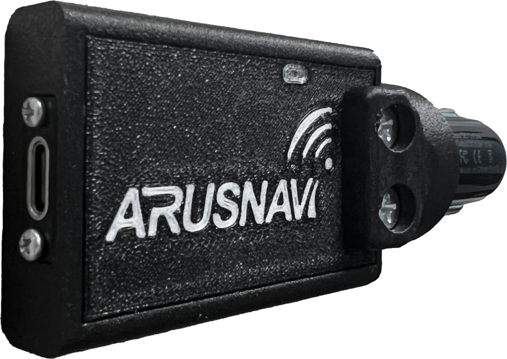

# Arusnavi - Arnavi L2 (cigarette lighter)

The Arnavi L2 (cigarette lighter) is a compact plug in GPS tracker and navigation controller designed for quick non invasive installation and portable telematics. Intended for vehicles that require fast transfer between units without hardwiring this model draws power from the cigarette lighter socket and provides continuous position reporting and basic telemetry suitable for taxis rental cars and service vehicles.

As a device that is Plaspy compatible out of the box the Arnavi L2 integrates with the Plaspy platform to provide real time tracking location history and sensor visibility. Its combination of cellular connectivity multi GNSS positioning Bluetooth Low Energy sensor support and local black box storage makes it a practical choice for fleet managers who need a portable reliable tracking unit that works with Plaspy for monitoring alerts and reporting.

## Key Highlights

- Plug and play cigarette lighter form factor for quick non invasive deployment and easy removal between vehicles.
- Real time position reporting using cellular data and multi GNSS positioning for consistent location information.
- Bluetooth Low Energy support for connecting wireless sensors to extend telemetry such as temperature or guard tags.
- Discrete ignition input and protected universal I O for ignition state reporting and basic actuator control.
- Built in motion sensing and driver behavior features for event based alerts and driving analysis.
- Local black box storage to preserve records during temporary connectivity loss and upload when a connection is restored.

## How It Works with Plaspy

When paired with Plaspy the Arnavi L2 sends position status and sensor data to the platform where it can be visualized analyzed and acted upon. Plaspy ingests the device telemetry and exposes it through mapping dashboards geofencing and historical reports so fleet teams can maintain operational oversight and respond to events.

- Real time location and status updates feed Plaspy maps and live monitoring dashboards for immediate visibility.
- Ignition input enables engine on off event tracking and helps Plaspy identify driver sessions and trip boundaries.
- Universal I O can be used for alarm output or remote immobilizer workflows coordinated through Plaspy for anti theft responses.
- BLE sensor data is relayed to Plaspy to support temperature monitoring door sensors and other wireless telemetry with alerting.
- Local black box buffering ensures data continuity during intermittent coverage and bulk upload to Plaspy when connectivity returns.

## Typical Use Cases

- Taxi fleets and ride services that need temporary device installation and rapid swaps between vehicles.
- Rental car operations requiring non invasive tracking on demand and anti theft notifications.
- Field service and delivery fleets that benefit from portable telemetry driver behavior monitoring and route replay.
- Deployments combining BLE sensors for temperature or guard tag monitoring alongside vehicle tracking.
- Short term trials or mobile units that require plug and play installation without permanent wiring.

## Why Choose This Tracker with Plaspy

The Arnavi L2 provides a pragmatic portable telematics option for organizations that need rapid deployment and straightforward compatibility with Plaspy. Its cigarette lighter design reduces installation time while the combination of GNSS positioning cellular connectivity and BLE sensor support covers common fleet monitoring needs without complex setup.

Paired with Plaspy the Arnavi L2 supports real time tracking alerts and historical reporting while preserving data locally during outages. If your operation values portability ease of use and integrated sensor telemetry the Arnavi L2 is a suitable Plaspy compatible choice for expanding visibility across mixed or temporary vehicle fleets.

To learn more about Plaspy visit https://www.plaspy.com. Product specifications availability and manufacturer details can change over time so please verify current technical information on the Arusnavi website https://www.arusnavi.ru.
