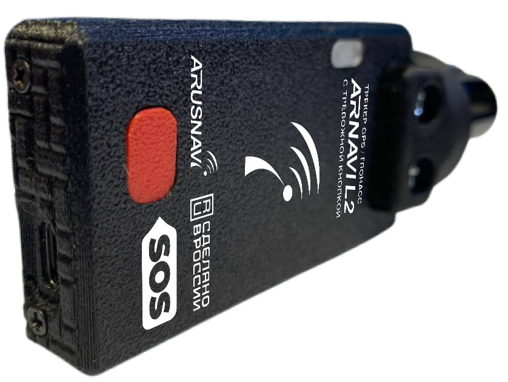

# Arusnavi - Arnavi L2 (cigarette lighter version with panic button)

The Arnavi L2 cigarette lighter version with panic button is a plug and play GPS tracker designed for fast, no-drill installation and easy relocation between vehicles. Geared toward fleet managers, rental and rideshare operators, and short term leased vehicles, the device provides continuous position reporting, driver behavior telemetry and a dedicated emergency alarm without requiring permanent wiring.

As a Plaspy compatible device, the Arnavi L2 can deliver position, event and sensor data into Plaspy for live monitoring and reporting. Its combination of multi constellation GNSS positioning, cellular telemetry, local logging and an integrated panic button make it a practical option for operators who need rapid deployment, anti theft measures and operational visibility through the Plaspy platform.

## Key Highlights

- Plug and play cigarette lighter harness for fast vehicle swaps and temporary installs.
- Dedicated panic button for immediate alarm reporting and incident awareness.
- Multi constellation GNSS positioning for robust location capture in varied environments.
- Cellular telemetry for near real time tracking and remote data upload.
- Built in accelerometer for towing detection and driving style events.
- BLE support for external sensor integration such as temperature, door or tag sensors.
- On board offline logging to preserve trip history when connectivity is intermittent.

## How It Works with Plaspy

The Arnavi L2 transmits GNSS position, telemetry and event data to Plaspy where it appears on dashboards, maps and reporting tools. When the device is out of coverage it stores records locally and uploads them to Plaspy once connectivity is restored, ensuring continuity of trip history and audits.

- Continuous location updates and basic telemetry feed Plaspy fleet visibility and live maps.
- Panic button presses and accelerometer triggered events are forwarded to Plaspy as alerts for rapid operator response.
- Offline black box records are uploaded to Plaspy after reconnection so historical data stays complete.
- BLE connected sensors and tags report accessory status and guard mode events into Plaspy sensor streams.
- Remote configuration and firmware update capabilities help keep devices aligned with Plaspy deployment settings.

## Typical Use Cases

- Short term rental and rideshare vehicles that need fast install and quick removal between drivers.
- Small to medium fleets where vehicles are frequently swapped and permanent wiring is undesirable.
- Parking guard mode and anti theft monitoring using the panic button and tow detection.
- Driver behavior and eco driving oversight using accelerometer based events and telemetry.
- Last mile or temperature sensitive delivery where BLE sensors monitor cargo conditions.

## Why Choose This Tracker with Plaspy

The Arnavi L2 offers a balance of ease of use and essential telemetry that fits operational needs for temporary or frequently reassigned vehicles. Its plug and play form factor reduces installation time while panic alarm capability and accelerometer events provide an added safety and anti theft layer that integrates into Plaspy workflows.

Paired with Plaspy, the Arnavi L2 allows operators to maintain live visibility, incident alerts and a continuous audit trail even when devices experience brief coverage gaps. For organizations that prioritize rapid deployment, simple relocation and integrated emergency signaling within a fleet platform, this tracker presents a practical, Plaspy compatible option.

To learn more about how Plaspy can work with compatible devices visit https://www.plaspy.com. Product specifications and availability can change over time, so please verify current technical details on the manufacturer site https://www.arusnavi.ru.
