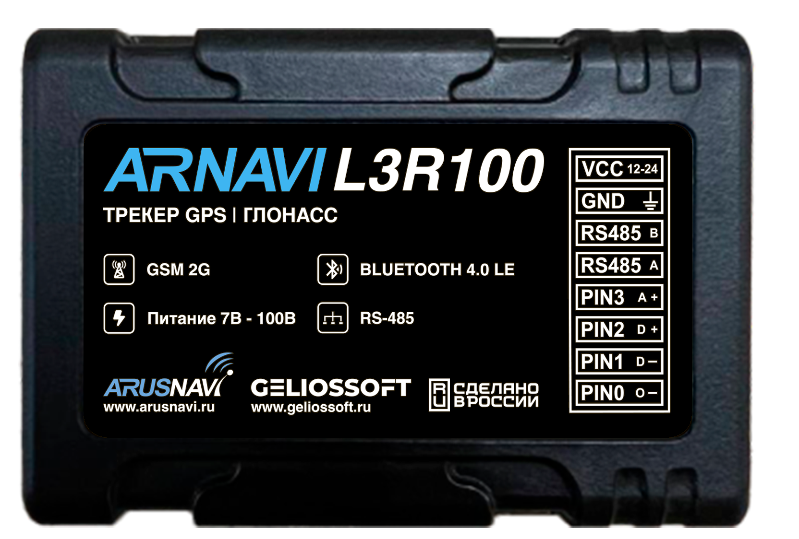

# Arusnavi - ARNAVI L3R100

The ARNAVI L3R100 is a compact navigation controller and GPS tracker designed for deployments that need accurate real time tracking, mixed wired and wireless telemetry, and low power operation. At 61 x 42 x 13 mm and 36 g it fits constrained installation areas while providing multi constellation GNSS location, 2G GPRS connectivity, and Bluetooth Low Energy support for wireless sensors, making it well suited for fleet and asset tracking scenarios.

As a Plaspy compatible device, the L3R100 transmits position, telemetry, and event data in formats supported by monitoring platforms, enabling live tracking, history playback, and alerting inside Plaspy. Its multi server transmission capability and a mix of inputs and sensor interfaces allow operators to consolidate location and telemetry streams into Plaspy for centralized fleet oversight and operational reporting.

## Key Highlights

- Plaspy compatible tracker with support for Arnavi and EGTS telemetry for straightforward data integration.
- Very small form factor and lightweight design for discreet or space constrained installations.
- Multi constellation GNSS reception for reliable position fixes in diverse environments.
- Bluetooth Low Energy connectivity to pair with up to eight wireless sensors for temperature, fuel, doors, and similar telemetry.
- RS485 support for wired sensor networks to collect fuel and other telemetry without additional gateways.
- Protected universal input output and discrete inputs to capture ignition, door, or external event states.
- Low power operation and internal black box storage to support extended deployments and local data buffering.

## How It Works with Plaspy

When used with Plaspy, the ARNAVI L3R100 delivers live position updates and telemetry to the platform where fleet managers can monitor vehicles, review events, and generate reports. Plaspy ingests GNSS and sensor data sent by the device, making it available for mapping, historical analysis, and automated alerts that support fleet operations and anti theft workflows.

- Live tracking and continuous position updates via GNSS and 2G GPRS connectivity for operational visibility.
- Sensor and input reporting such as ignition or door status to support driver and vehicle state monitoring.
- Aggregation of BLE and wired RS485 sensor telemetry for fuel, temperature, and cargo monitoring inside Plaspy.
- Event driven alerts and server side rules based on device inputs and telemetry for timely notifications.
- Historical route playback and reporting to analyze trips, utilization, and recurring behaviors.

## Typical Use Cases

- Fleet vehicle tracking and route history for logistics and transport operators.
- Anti theft workflows using discrete inputs and remote relay control for immobilization and recovery procedures.
- Remote telemetry collection for fuel and temperature monitoring using a mix of wired RS485 sensors and BLE devices.
- Compact asset and covert installations where size and weight are limiting factors.
- Mixed wired and wireless sensor deployments where extending telemetry without full rewiring is desirable.

## Why Choose This Tracker with Plaspy

The ARNAVI L3R100 provides a practical combination of small size, multi constellation GNSS, and flexible sensor connectivity that fits many Plaspy based projects. Its ability to handle both BLE sensors and wired RS485 sensors simplifies consolidating telemetry streams into Plaspy for unified monitoring, reporting, and event handling.

If you are evaluating compact trackers for fleet management, anti theft protection, or remote telemetry collection, the ARNAVI L3R100 is a capable option to consider for Plaspy integration. Learn more about Plaspy on the main website https://www.plaspy.com. Product specifications and availability can change over time, so verify current details and official documentation on the manufacturer site https://www.arusnavi.ru.
