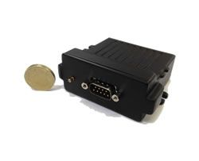

# Astra Telematics - AT210

The Astra Telematics AT210 is a compact automotive style GPS tracker built for precise and reliable location monitoring. It combines a SiRFStar IV GPS receiver with a Cortex M3 processor to provide accurate positioning and responsive operation. The unit is sealed to IP67 standards for water resistance and uses a durable plastic casing, making it suitable for demanding outdoor and vehicle mounted deployments. Design features noted by the manufacturer include internal GPS and GSM antennas, a backup battery, internal memory for data storage, and options such as an external GPS antenna and Driver ID.

As a Plaspy compatible device, the AT210 can be integrated into fleet and asset management workflows to provide live location visibility and historical tracking. Its support for common communication methods and event based reporting makes it a practical choice for organizations that need straightforward connectivity to a platform like Plaspy. The device’s discreet automotive appearance and mounting flexibility help it fit a range of vehicle and asset tracking scenarios while allowing Plaspy users to consolidate tracking data in a single platform.

## Key Highlights

- Precise positioning using SiRFStar IV GPS combined with a Cortex M3 processor for responsive tracking
- IP67 sealed enclosure for protection against dust and water in outdoor or vehicle environments
- Integrated GPS and GSM antennas with optional external GPS antenna for flexible mounting
- Built in backup battery and internal memory to maintain tracking continuity and store data
- Supports common communication methods and event based reporting for compatibility with tracking platforms
- Includes extra connectivity options such as Driver ID and a serial port for extended functionality
- European manufacturing and automotive friendly design that blends durability with a discreet appearance

## How It Works with Plaspy

When connected to Plaspy, the AT210 delivers position updates and event notifications that feed into Plaspy’s fleet management and monitoring features. Plaspy aggregates location and event data from compatible devices like the AT210 so teams can monitor assets, generate reports, and respond to operational needs from the Plaspy platform.

- Live location tracking for vehicles and assets visible within Plaspy maps and dashboards
- Historical route and event playback using the AT210 internal memory and Plaspy reporting tools
- Alerts and notifications based on device events or position changes routed through Plaspy
- Centralized fleet oversight combining AT210 data with other devices for unified monitoring
- Operational reporting for utilization, route analysis, and summary exports inside Plaspy

## Typical Use Cases

- Fleet vehicle tracking for dispatch and route monitoring
- Asset protection and recovery where discreet mounting and IP67 protection are required
- Driver identification and logging for transport or service fleets using Driver ID support
- Long term route history and event based reporting for operations analysis
- Deployments that benefit from an external antenna option when GPS visibility varies

## Why Choose This Tracker with Plaspy

The AT210 is a practical option for organizations that want a durable, automotive styled tracker with a balance of positioning accuracy and operational features. Its combination of SiRFStar IV positioning, event based tracking, internal memory, and backup power makes it suitable for routine fleet management and asset monitoring tasks. For teams using Plaspy, the AT210 provides the kind of location and event data that Plaspy can surface in dashboards, alerts, and reports without requiring complex integration work.

If you are evaluating devices for use with Plaspy, the AT210 is worth considering where a weather sealed, discreet tracker with flexible connectivity is needed. For more details about device capabilities and to confirm current specifications, learn more about Plaspy on the main website https://www.plaspy.com and verify the latest product specifications and availability on the manufacturer's site https://astratelematics.com/. Product specifications and availability can change over time so checking the official manufacturer documentation is recommended.
