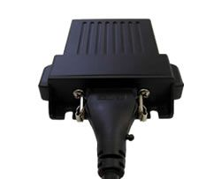

# Astra Telematics - AT240

The Astra Telematics AT240 is a compact automotive GPS tracker designed for vehicle and fleet applications. It combines a SiRFStar IV GPS receiver and a Cortex M3 processor to deliver reliable position information, while integrated antennas and automotive styling keep the unit discreet. Built with IP67 sealing, the AT240 is intended to withstand demanding conditions and remain operational in a range of environments.

As a device compatible with Plaspy, the AT240 can feed location and status data into Plaspy's fleet management environment for real time oversight and reporting. Its support for Bluetooth Low Energy and CANBus connectivity allows it to work with vehicle systems and nearby devices, making the tracker a practical choice for organizations that need consistent tracking, fleet visibility, and asset management through Plaspy.

## Key Highlights

- Accurate location tracking using a SiRFStar IV GPS receiver for dependable position data
- Efficient on-device processing courtesy of a Cortex M3 processor
- Bluetooth Low Energy support for short range device interactions and add on connectivity
- CANBus compatibility to access vehicle data streams where available
- IP67 rated housing for resistance to dust and water in demanding environments
- Integrated internal antennas and automotive styling for a discreet installation appearance

## How It Works with Plaspy

When paired with Plaspy, the AT240 provides continuous location updates and event data that Plaspy consolidates into a single management interface. That enables fleet managers to monitor assets, review history, and act on alerts without needing to manage raw device connections.

- Real time location visibility and status reporting in the Plaspy dashboard
- Historical route playback and trip logs for post trip analysis and reporting
- Event and alert delivery to notify operators about movement, geofence entries, or configured conditions
- Consolidation of vehicle data via CANBus into Plaspy for operational oversight where vehicle data is available
- Use of Bluetooth Low Energy for local device interactions that complement vehicle tracking data

## Typical Use Cases

- Fleet management for small to medium vehicle fleets requiring centralized tracking
- Track and trace operations to maintain visibility over asset locations
- Vehicle recovery scenarios where accurate and persistent tracking aids retrieval
- Telematics projects that combine location and vehicle data for operational reporting
- Route verification and journey history for compliance or performance analysis

## Why Choose This Tracker with Plaspy

The AT240 is a solid choice for organizations looking for a rugged, vehicle focused tracker that integrates into a modern fleet platform. Its combination of a capable GPS receiver, on board processing, and vehicle connectivity options makes it suitable for common fleet and telematics needs without being overly complex.

If you need a compact, discreet tracker that can report location and vehicle status into a centralized platform, the AT240 paired with Plaspy offers a practical solution for monitoring, reporting, and operational oversight. To learn more about Plaspy and how it can work with compatible devices like the AT240 visit https://www.plaspy.com. Product specifications and availability can change over time, so please verify current technical details on the manufacturer site https://astratelematics.com/.
