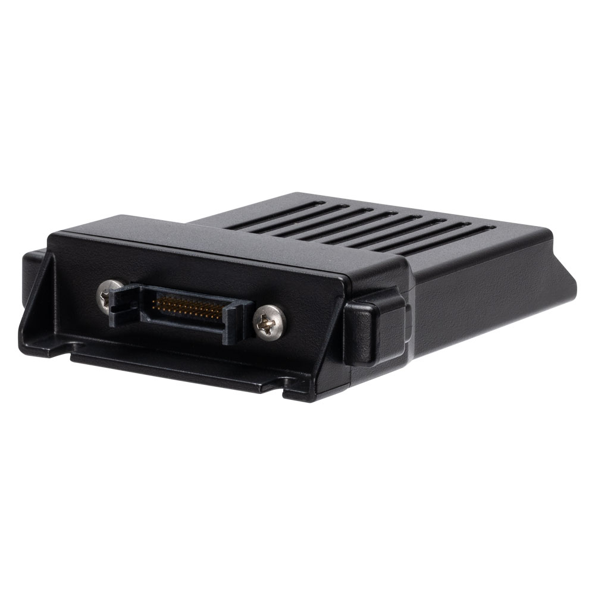

# Astra Telematics - AT241

The AT241 is a rugged GPS tracker engineered for continuous vehicle and asset monitoring and is fully Plaspy compatible out of the box. Built for exposed installations with IP67 waterproof sealing and a compact footprint, the AT241 brings high-sensitivity GNSS positioning, multi-generation cellular connectivity and a broad set of I/O to enable real-time tracking, telemetry and anti-theft workflows in demanding fleet management and security environments.

The AT241 is suitable for fleet managers, vehicle sharing platforms and heavy equipment operators who need a durable Plaspy compatible tracker that supports driver ID, accelerometer-based motion detection, tamper alerts and flexible integrations via BLE and CANBus. With internal backup power, lifetime system updates and a five-year warranty, the AT241 is a long-term GPS tracker solution for scalable telemetry and operational visibility.

## Key Highlights

- Plaspy compatible for seamless integration into real-time tracking and fleet management dashboards.
- IP67-rated rugged housing for reliable operation in rain, dust and harsh outdoor conditions.
- Multi-generation cellular connectivity \(GSM/GPRS 2G, LTE‑M 4G\) with NB‑IoT readiness for future-proof telemetry.
- Internal GNSS \(Mediatek chipset, 25mm ceramic patch\) supporting GPS, Galileo, GLONASS and BeiDou for high-sensitivity location.
- Comprehensive I/O: 6 digital inputs, 5 digital outputs, 2 ADC inputs, 2 RS232 ports, 1-Wire support and CANBus for rich accessory and sensor integration.
- Tamper detection and MEMS accelerometer enable anti-theft alerts, impact detection and motion-based reporting.
- Optional Bluetooth Low Energy \(BLE\) interface for local sensor and beacon integrations; available kit variants simplify installation.
- Internal 510mAh backup battery with multi-day standby capability in low-power reporting modes and wide operating voltage range for vehicle and asset use.

## How It Works with Plaspy

When used with Plaspy, the AT241 delivers continuous location, telemetry and event data for real-time tracking and automated reporting. Plaspy ingests the device’s GNSS coordinates, motion and I/O events to power live maps, geofencing alerts, driver events and scheduled reports. The device’s flexible inputs and outputs let you map hardware signals to Plaspy events—enabling workflows such as ignition-based trips, tamper alerts and remote output control.

- Real-time location and telemetry updates delivered to Plaspy for live tracking and historical playback.
- Ignition, door and alarm status via configurable digital inputs mapped to Plaspy events \(where inputs are used for those signals\).
- Fuel monitoring possible using the AT241’s ADC inputs and compatible external sensors, with data forwarded into Plaspy reports.
- Remote immobilizer or controlled outputs can be implemented via digital outputs and managed through Plaspy alarms and actions \(installation-dependent\).
- Bluetooth sensors and beacons \(optional BLE\) supported for local telemetry such as temperature, proximity or driver tag detection tied into Plaspy dashboards.

## Technical Overview

| Connectivity | GSM/GPRS \(2G\) and LTE‑M \(4G\) cellular support; NB‑IoT ready |
| --- | --- |
| Bands | Supports multi-generation mobile links \(2G/4G\); specific regional band support per variant and SIM selection |
| Power & Battery | Internal 510mAh backup battery; operating voltage range 6.0V–50.0V \(product icons note 65V capability\) |
| Interfaces | 6 digital inputs, 5 digital outputs, 2 ADC inputs, 2 RS232 ports, 1-Wire/Dallas, CANBus, Driver ID capability, AUX 3.3V output |
| GNSS | Mediatek GNSS chipset with 25mm ceramic patch internal antenna; supports GPS, Galileo, GLONASS and BeiDou |
| Bluetooth | Optional Bluetooth Low Energy \(BLE\) interface available for local sensor and beacon integration |
| Remote Management | Manufacturer-provided system updates for life; hardware and reporting customization included |
| Form Factor | Compact, rugged IP67 enclosure designed for exposed vehicle and asset installations |

## Use Cases

- Fleet management: live GPS tracker data, driver ID events and CANBus telemetry feed into Plaspy for route optimization and compliance reporting.
- Vehicle sharing platforms: tamper detection, immobilizer-capable outputs and BLE-driven driver or keyfob detection for secure, automated rentals.
- Heavy equipment telematics: waterproof design and wide operating voltage range make the AT241 ideal for construction and agricultural machinery monitoring.
- Security monitoring and anti-theft: accelerometer-based impact alerts, tamper notifications and remote output control help protect assets on Plaspy-managed alarms.
- Sensorized assets: ADC inputs and optional BLE sensors allow fuel monitoring, temperature sensing and other telemetry to be reported into Plaspy.

## Why Choose This Tracker with Plaspy

The AT241 combines enterprise-grade durability with broad protocol and I/O support to deliver a reliable GPS tracker for Plaspy deployments. Its Plaspy compatibility ensures straightforward onboarding into real-time tracking and fleet management workflows, while internal GNSS, multi-generation cellular links and tamper-proofing provide resilient telemetry in challenging environments. The device’s flexible interfaces—ADC, digital I/O, RS232 and CANBus—mean you can integrate ignition signals, fuel sensors and driver ID without custom hardware work, and optional BLE expands local sensor options. Lifetime system updates and included customization reduce long-term maintenance overhead, making the AT241 a cost-effective, scalable solution for anti-theft, telemetry and fleet management projects.

