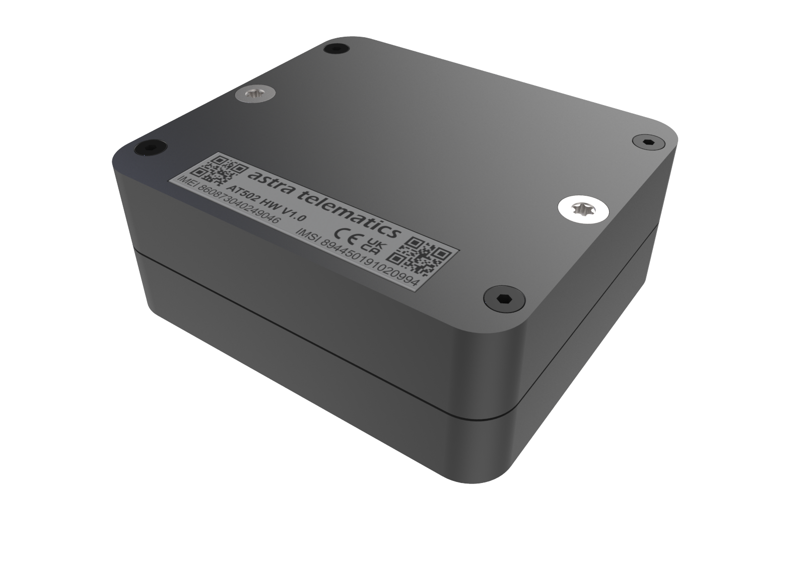

# Astra Telematics - AT502

# Astra Telematics AT502

The AT502 from Astra Telematics is a compact, battery-powered GPS tracker designed for discreet, long-term monitoring of the smallest unpowered assets. Built for endurance, the AT502 combines GNSS multi-constellation positioning, low-power cellular communications \(LTE‑M and NB‑IoT with GSM fallback\), and Bluetooth LE configuration to deliver a Plaspy compatible solution that simplifies real-time tracking and remote asset telemetry.

The AT502 is ideal where size, battery life and environmental resistance matter: internal 7.8Ah \(7800 mAh\) LTC battery chemistry, user-replaceable 3 x AA size LTC cells, IP68 ingress protection and multiple secure mounting options mean the device installs easily on containers, tools, equipment and other portable items. As a Plaspy compatible GPS tracker, it integrates with fleet management, anti-theft workflows and reporting dashboards while keeping installation and maintenance overheads low.

## Key Highlights

- Exceptional battery endurance — up to 5 years in typical low-power reporting modes \(24‑hour reporting\), reducing maintenance trips.
- Compact, discreet form factor with internal GNSS and GSM antennas and GNSS antenna size ~15mm for reliable positioning across regions.
- Future-proof cellular connectivity: LTE‑M and NB‑IoT with GSM/GPRS \(2G\) fallback for broad network coverage.
- Multi-constellation GNSS support \(GPS, Galileo, GLONASS, BeiDou\) for accurate, consistent location data.
- BLE \(Bluetooth Low Energy\) for simple on-site configuration and diagnostics via smartphone apps.
- Robust environmental protection \(IP68\) and flexible mounting: built-in magnetic mount and M4 bolt fixings for secure attachment.
- User-serviceable battery design \(3 x AA size LTC cells\) and an internal 7800 mAh pack for easy field maintenance.
- 5 year manufacturer warranty and system updates for life; hardware and reporting options can be customised at no extra cost.

## How It Works with Plaspy

When paired with Plaspy, the AT502 sends GNSS positions and device telemetry over cellular networks to the Plaspy platform for real-time tracking, historical playback, alerts and exports. Plaspy ingests location fixes, motion events and battery/connectivity health data so operators can manage assets, trigger anti-theft alerts and generate fleet management reports. BLE enables on-site configuration and diagnostics using a smartphone before or after installation.

- Real-time location and telemetry updates delivered to Plaspy using LTE‑M, NB‑IoT or GSM.
- Motion detection via integrated MEMS accelerometer for movement alerts and activity reporting.
- BLE for secure, local configuration and diagnostics with smartphone tools.
- Battery status and signal health reporting to help schedule maintenance and replacements.
- Plaspy compatibility enables fleet management and anti-theft workflows; note that ignition, immobilizer or fuel monitoring require a device with dedicated I/O \(the AT502 has minimal external I/O\).

## Technical Overview

| Connectivity | LTE‑M, NB‑IoT, GSM/GPRS \(2G\) fallback |
| --- | --- |
| Bands | Cellular technologies: LTE‑M / NB‑IoT / GSM \(specific bands depend on region / variant\) |
| Power & Battery | Internal 7.8Ah \(7800 mAh\) LTC battery; user-replaceable battery design \(3 x AA size LTC cells\). Battery life up to 5 years in typical low-power 24‑hour reporting modes. |
| Interfaces | Minimal external I/O; no CANBus, RS232, ADC or digital outputs. No LED indicators and no tamper sensor. |
| GNSS | GPS, Galileo, GLONASS, BeiDou. Internal GNSS antenna \(approx. 15 mm\). |
| Bluetooth | BLE for configuration and diagnostics via smartphone applications. |
| SIM | e‑SIM supported for simplified provisioning. |
| Ingress Protection | IP68 for harsh environments. |
| Mounting & Form Factor | Compact mini asset tracker with built-in magnetic mount and M4 bolt fixings for secure attachment. |
| Warranty & Updates | 5 year warranty; system updates for life. Hardware and reporting options customizable. |

## Use Cases

- Long-term tracking of small unpowered assets such as tools, instrument cases, and portable equipment where discreet installation matters.
- Container and pallet monitoring in logistics operations that rely on periodic location checks and long battery life rather than continuous telemetry.
- Inventory and rental equipment management for fleet managers who need reliable asset visibility without frequent maintenance visits.
- Anti-theft and recovery workflows where motion detection and cloud alerts via Plaspy help locate moved assets quickly.

## Why Choose This Tracker with Plaspy

As a Plaspy compatible GPS tracker, the AT502 is optimized for customers who prioritize long battery life, discreet installation and low maintenance. Its multi-constellation GNSS and multi-mode cellular stack provide consistent location reports across regions, and BLE simplifies field setup and diagnostics. For fleet management and asset visibility programs, the AT502 reduces operating cost by extending service intervals and feeding reliable telemetry to Plaspy for reporting, geofencing and anti-theft alerting.

Keep in mind that while Plaspy supports a wide range of telemetry, fuel monitoring, ignition events and immobilizer control for devices with dedicated inputs, the AT502 is purpose-built for passive, long-life asset tracking and does not provide CAN, ADC, RS232, dedicated digital outputs or immobilizer interfaces. If your deployment requires fuel monitoring, ignition sensing or remote immobilization, Plaspy can combine AT502 data with other vehicle-grade devices in the same management console.

For organisations deploying many small assets, the AT502 offers a cost-effective, scalable and maintenance-friendly way to add persistent visibility to Plaspy-managed fleets and inventories. Replacement battery packs and accessories are available from Astra Telematics, and pre-configured service plans and online quoting simplify procurement and rollout.

