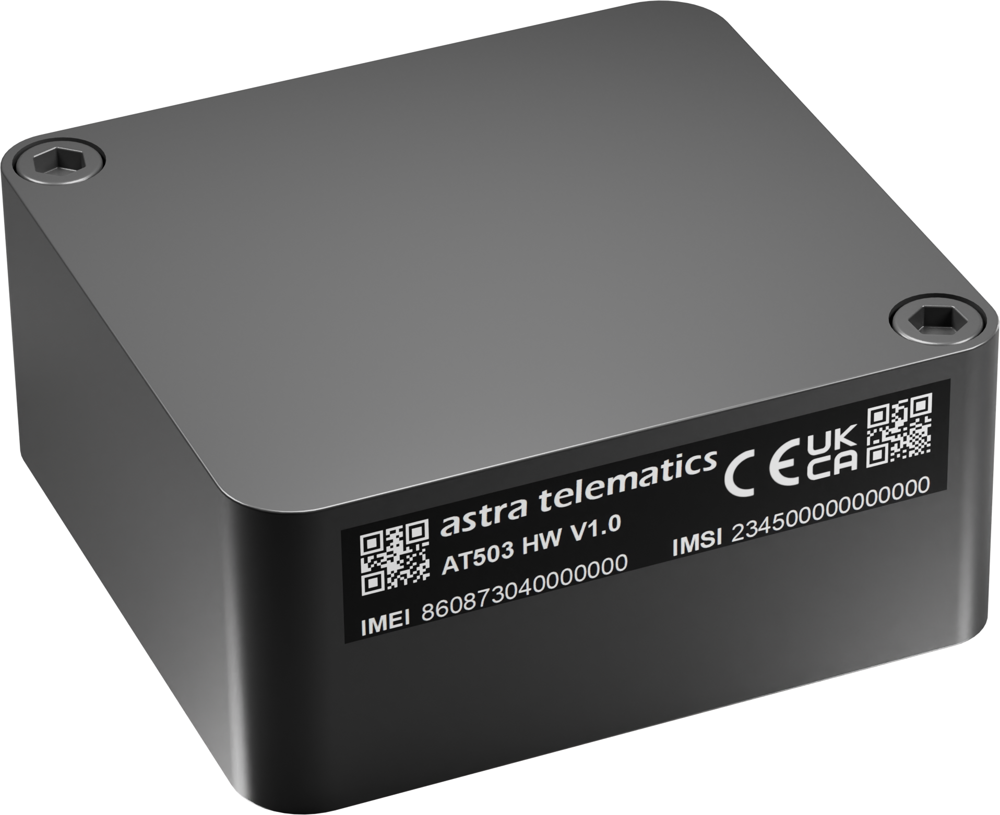

# Astra Telematics - AT503

The AT503 Mini Asset Tracker from Astra Telematics is a purpose-built GPS tracker designed for long-life, low-maintenance monitoring of unpowered assets. Epoxy-encapsulated and rated IP68, the AT503 delivers rugged durability in a compact package and is fully Plaspy compatible for seamless integration with Plaspy’s real-time tracking and telemetry platform.

Designed for large-scale rollouts and demanding outdoor environments, the AT503 combines multi-constellation GNSS positioning, LTE-M / NB‑IoT connectivity with 2G fallback, and ultra-low-power electronics to provide up to five years of battery life in typical low-frequency reporting profiles. On-site setup and diagnostics are fast and simple thanks to Bluetooth Low Energy \(BLE\) provisioning via smartphone.

## Key Highlights

- Plaspy compatible GPS tracker for reliable real-time tracking and telemetry across fleets of non-powered assets.
- Ultra-low-power design with a large internal 7800 mAh LiFeS2 \(LTC\) battery providing up to 5 years in typical 24-hour reporting profiles.
- Multi-constellation GNSS \(GPS, Galileo, GLONASS & Beidou\) with an internal 15 mm GNSS antenna for improved position reliability.
- Future-proof cellular connectivity: LTE‑M and NB‑IoT with GSM/GPRS \(2G\) fallback and an integrated e‑SIM for remote provisioning.
- Rugged, maintenance-free construction: epoxy encapsulation, internal antennas, IP68 ingress protection, no external ports or LEDs.
- Integrated MEMS accelerometer for movement detection and intelligent report triggers to extend battery life.
- Flexible mounting: integrated magnetic mount plus provision for 2 x M4 bolt attachment for secure installation.
- Bluetooth Low Energy for fast on-site configuration and diagnostics using a smartphone.

## How It Works with Plaspy

When paired with Plaspy, the AT503 provides persistent location and movement telemetry that feeds directly into Plaspy’s dashboards, maps, and alerting engine. The device’s low-power reporting modes and intelligent accelerometer-driven wake logic allow you to balance update frequency and battery life according to fleet requirements. Because the AT503 uses LTE‑M / NB‑IoT with GSM fallback and an e‑SIM, it can report location and status to Plaspy reliably across wide coverage areas.

- Real-time location and telemetry updates delivered to Plaspy via cellular networks \(LTE-M / NB‑IoT / GSM fallback\).
- Movement detection \(integrated MEMS accelerometer\) triggers intelligent reporting, geofence events, and anti-theft alerts.
- GNSS multi-constellation fixes \(GPS, Galileo, GLONASS & Beidou\) provide consistent positioning for Plaspy maps and routing.
- Bluetooth Low Energy for on-site configuration and diagnostics with a smartphone app to streamline field commissioning.
- Battery and health reporting to Plaspy so fleet managers can schedule replacements and avoid downtime.

## Technical Overview

| Connectivity | LTE‑M and NB‑IoT with GSM/GPRS \(2G\) fallback; integrated e‑SIM for connectivity provisioning |
| --- | --- |
| Bands / Network Modes | Supports LTE‑M, NB‑IoT and 2G \(GSM/GPRS\) network modes; specific band details available from the manufacturer datasheet |
| Power & Battery | Internal non-replaceable LiFeS2 \(LTC\) battery, 7800 mAh; up to 5 years in typical low-power reporting profiles \(example: 24‑hour reporting\) |
| Interfaces | Bluetooth Low Energy \(BLE\) for on-site configuration and diagnostics; no external ports; no LED indicators; no CAN bus, ADC inputs, digital I/O or tamper sensors by default |
| GNSS | Multi‑constellation GNSS: GPS, Galileo, GLONASS & Beidou with internal 15 mm GNSS antenna |
| Bluetooth | Bluetooth Low Energy \(BLE\) for smartphone provisioning and field diagnostics |
| Remote Management | e‑SIM provisioning and manufacturer-provided reporting/hardware customization options; lifetime system updates and 5-year warranty from Astra Telematics |
| Form Factor & Durability | Epoxy-encapsulated, IP68 ingress protection, internal GSM and GNSS antennas, integrated magnetic mount and 2 x M4 bolt mounting points |

## Use Cases

- Trailers and container tracking — long battery life and rugged encapsulation suit prolonged outdoor use and infrequent servicing.
- Construction and rental equipment monitoring — track location and movement for asset utilization and recovery.
- Remote asset fleets and large-scale rollouts — low total cost of ownership with minimal field maintenance requirements.
- Anti-theft alerting and recovery workflows — movement-triggered reporting provides timely location telemetry to Plaspy.
- General unattended asset tracking where ignition, CAN bus or fuel monitoring are not required but long-term telemetry and location are essential.

## Why Choose This Tracker with Plaspy

The AT503 is ideal when you need a Plaspy compatible GPS tracker that prioritizes battery life, durability and low maintenance. Its epoxy-encapsulated, IP68 design and internal antennas make it resilient in harsh outdoor environments, while LTE‑M/NB‑IoT connectivity with e‑SIM provisioning reduces deployment friction at scale. The integrated accelerometer enables smart telemetry that maximizes battery life without sacrificing timely location updates. Astra Telematics backs the device with a 5-year warranty and lifetime system updates, and offers hardware/reporting customization for tailored fleet management solutions.

Note: the AT503 is focused on long-term, maintenance-free asset tracking of unpowered assets. It does not include CAN bus, ADC inputs, digital I/O, built-in tamper sensors, ignition inputs, or immobilizer outputs, and therefore is not intended as a direct replacement where fuel monitoring, ignition sensing, or remote immobilization are required. Instead, the AT503 pairs with Plaspy to provide dependable GPS-based location, movement telemetry and fleet-level visibility; for fleets that require fuel monitoring or immobilizer control, the AT503 can be used alongside Plaspy-compatible devices that provide those interfaces.

