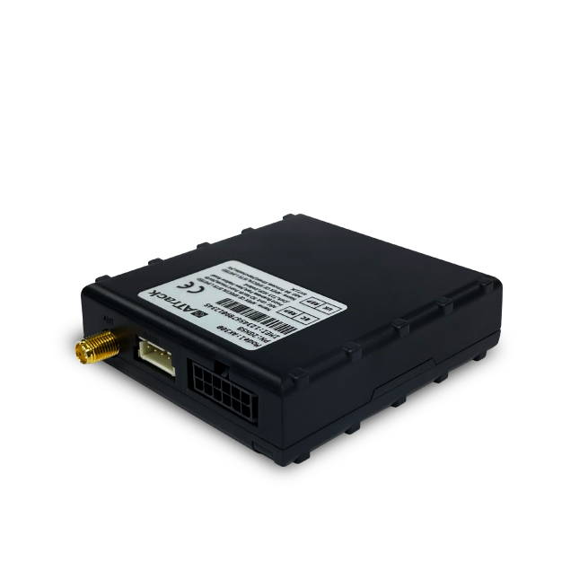

# ATrack - AK300

The AK300 is a professional vehicle GPS tracker from ATrack designed for fleet management and safety monitoring. Built to capture real-time tracking and telemetry, the AK300 reports precise GPS/GLONASS positioning plus mileage, speed, fuel consumption, and engine status to enable operational insights and timely alerts. Its feature set is aimed at mixed fleets and demanding vehicle environments where continuous visibility and reliable data matter.

As a Plaspy compatible device, the AK300 can be integrated into Plaspy to deliver vehicle location, telemetry, and event information within a unified fleet management platform. That compatibility enables fleet operators to use Plaspy dashboards, alerts, and reporting tools with data from the AK300 for improved dispatching, anti-theft readiness, preventive maintenance planning, and driver safety programs.

## Key Highlights

- Plaspy compatible GPS tracker providing real time tracking and fleet telemetry
- GPS and GLONASS positioning for improved location accuracy in vehicle environments
- LTE connectivity with fallback options for broad coverage and dependable data transport
- Robust vehicle inputs and configurable outputs to support trip detection and remote actions
- Fuel consumption and mileage reporting to support cost control and operational reporting
- Optional wireless sensor support and local data logging for resilient operation
- Rugged design and commercial certifications suitable for mixed vehicle deployments

## How It Works with Plaspy

When integrated with Plaspy, the AK300 becomes a continuous source of vehicle location, telemetry, and event data that Plaspy can display, analyze, and act upon. Fleet managers use Plaspy to set thresholds, receive alerts, and build reports based on AK300 inputs so that field operations are visible and manageable from a central platform.

- Real time location and telemetry updates appear on Plaspy dashboards for route monitoring
- Ignition and digital input events feed Plaspy to mark trip start/stop and door or alarm conditions
- Fuel and mileage reporting help Plaspy generate consumption analysis and cost reports
- Configurable outputs can be tied to operational policies such as immobilizer or remote cut-off where supported
- Optional wireless sensors provide additional events for temperature monitoring or tire management
- Local logging ensures events are retained and forwarded to Plaspy when connectivity resumes

## Typical Use Cases

- Fleet anti-theft and rapid response with real time tracking and configurable outputs
- Driver safety and behavior monitoring to reduce risky driving and improve compliance
- Fuel monitoring and telematics for route optimization and cost control
- Environmental and tire monitoring using optional sensors for sensitive cargo
- Mixed vehicle deployments where rugged hardware and regional variants are required

## Why Choose This Tracker with Plaspy

The AK300 offers a practical combination of precise positioning, broad cellular coverage, and extensive vehicle I/O that maps well to Plaspy's visibility and alerting features. Feeding ignition, telemetry, and event data into Plaspy helps operators reduce downtime, detect theft or misuse, and run data driven maintenance and safety programs. Optional sensor support and onboard logging increase flexibility for varied fleet needs without constraining fleet workflows.

If you want to learn more about how the AK300 works within Plaspy and whether it matches your operational requirements, visit the Plaspy website to explore platform capabilities and deployment options https://www.plaspy.com. Product specifications and availability can change over time, so please verify the latest technical details and regional variants on the manufacturer's official website https://www.atrack.com.tw/.
