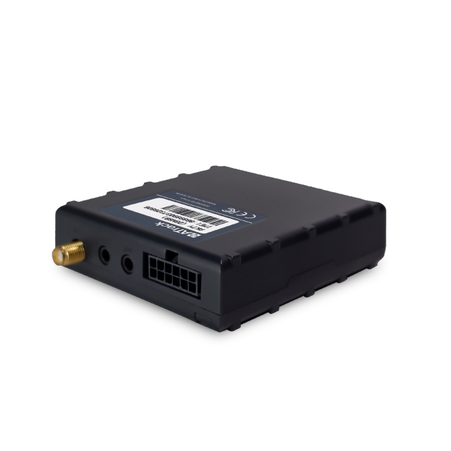

# ATrack - AK7V

The ATrack AK7V is a powerful GPS tracker that offers advanced features for monitoring and controlling vehicles. With its ability to accurately track vehicle location and remotely control the I/O port, the AK7V provides users with real-time data on vehicle status and location. This makes it an ideal choice for fleet management and vehicle tracking applications.

One standout feature of the AK7V is its two-way voice function, which allows for efficient and convenient communication between drivers and fleet managers. This feature can greatly improve communication and coordination, leading to increased productivity and better overall management of the fleet.

In addition to its tracking and communication capabilities, the AK7V also supports various connectivity options. It offers 4G Cat.1/3G/2G connectivity, ensuring reliable and fast data transmission. The tracker also features CAN bus support, allowing it to gather detailed vehicle engine data. Furthermore, the AK7V is equipped with Bluetooth 4.2, enabling wireless connectivity with sensors and other devices for applications such as tire-pressure monitoring.

With its robust features and compatibility with different vehicle protocols, the ATrack AK7V is a versatile and reliable GPS tracker that can meet the needs of various industries and applications. Whether you need to track a single vehicle or manage a large fleet, the AK7V offers the functionality and performance required for effective vehicle monitoring and control.

### Key Features:

- Accurate vehicle location tracking
- Remote control of I/O port
- Two-way voice communication
- 4G Cat.1/3G/2G connectivity
- CAN bus support for detailed vehicle engine data
- Bluetooth 4.2 for wireless sensor connectivity

