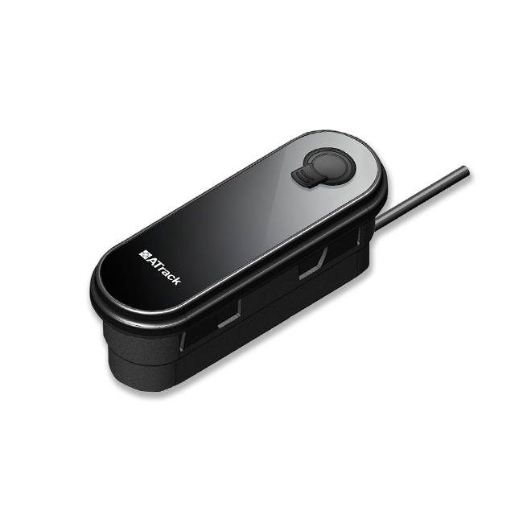

# ATrack - AL100

The AL100 is a rugged e mobility tracker from ATrack designed for reliable real time tracking of e bikes in rental fleets and private ownership. Built with a weather resistant enclosure and cellular connectivity, the device focuses on continuous location reporting and vehicle telemetry in outdoor and demanding conditions. It is positioned for fleet operators who need persistent tracking and data visibility for distributed bike assets.

As a Plaspy compatible device, the AL100 can feed location and telemetry into Plaspy for consolidated fleet monitoring and reporting. When integrated with Plaspy, operators can view mileage, speed, cadence, torque and battery health alongside maps, alerts and historical reports to support maintenance, theft recovery and operational decision making. Optional integrations such as CAN Bus and Bluetooth extend the device telemetry and can be surfaced in Plaspy dashboards when enabled.

## Key Highlights

- Designed for e mobility and e bike deployments with a rugged, weather resistant enclosure for outdoor use.
- Compatible with Plaspy for consolidated fleet management and live tracking across e bike assets.
- Cellular connectivity for continuous location and telemetry suitable for urban and remote coverage.
- Tracks key e bike metrics including mileage, speed, cadence, torque and battery health for operational insight.
- Optional CAN Bus integration enables deeper motor and vehicle data when required for maintenance planning.
- Optional Bluetooth support allows pairing with additional sensors and mobile apps to expand telemetry.

## How It Works with Plaspy

Integrating the AL100 with Plaspy turns device telemetry into operational information through live maps, alerts, historical reporting and workflow triggers. Plaspy ingests the AL100 feeds so fleet teams can monitor assets, respond to exceptions and analyze usage patterns from a single platform.

- Live location updates and map visualization for tracking distributed e bike fleets in real time.
- Telemetry dashboards for mileage, speed, cadence and torque to support utilization and maintenance decisions.
- Battery level and temperature monitoring surfaced as alerts and reports to reduce unexpected downtime.
- Driving behavior and event data available for safety scoring and operational review within Plaspy.
- Support for optional Bluetooth and CAN Bus sources to add sensor data and motor telemetry into Plaspy views.

## Typical Use Cases

- Fleet management for e bike rental and sharing services with live tracking and usage metrics.
- Theft recovery and anti theft monitoring through movement alerts and location history.
- Maintenance planning and scheduling based on battery health, motor temperature and accumulated mileage.
- Rider safety and behavior programs that use event data to reduce incidents and improve training.
- Extended deployments that add sensor data via Bluetooth to monitor locks, proximity or environmental conditions.

## Why Choose This Tracker with Plaspy

The AL100 is a focused e mobility tracker that combines rugged hardware with broad telemetry suited to fleet and rental scenarios. Its feature set makes it a practical match for organizations that need continuous visibility into e bike location, battery condition and motor performance, while optional integrations provide a path to deeper insights when fleets require them.

Pairing the AL100 with Plaspy gives operators a single pane of glass for monitoring, alerting and reporting across mixed fleets, helping reduce manual checks and improve response times. To learn more about Plaspy and how it supports device integrations, visit https://www.plaspy.com. Product specifications, availability and manufacturer details can change over time, so please verify current technical information and options with the manufacturer at https://www.atrack.com.tw/.
