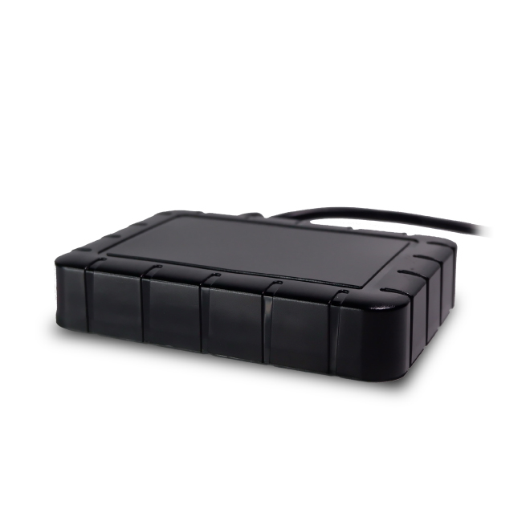

# ATrack - AL11

The ATrack AL11 is a 4G LTE/3G IP rated tracking device that is perfect for monitoring a wide range of mobile assets. With its advanced features and reliable performance, this tracker is an excellent choice for various tracking applications. Whether you need to keep an eye on your fleet of vehicles or track valuable assets, the AL11 is designed to meet your needs.

One of the standout features of the AL11 is its connectivity options. It supports 4G Cat.1/3G connectivity, ensuring fast and reliable data transmission. This means that you can track your assets in real-time and receive accurate and up-to-date information about their location and status.

In addition to its impressive connectivity, the AL11 also boasts a ruggedized enclosure with an IP67 rating. This means that it is protected against water and dust, making it suitable for use in harsh environments. Whether your assets are exposed to rain, dust, or other challenging conditions, you can trust that the AL11 will continue to perform reliably.

Installation of the AL11 is a breeze thanks to its 3-wire connection. This makes it easy to covertly install the tracker without drawing attention. Once installed, you can rely on the AL11 to provide accurate and detailed tracking information, allowing you to effectively monitor and manage your assets.

Overall, the ATrack AL11 is a flexible and reliable tracking device that is perfect for a wide range of applications. With its advanced features, rugged design, and easy installation, it is an excellent choice for anyone in need of a high-quality GPS tracker.

### Outstanding Features:

- 4G Cat.1/3G connectivity for fast and reliable data transmission
- IP67-rated housing design for water and dust protection
- Built-in 3-axis accelerometer for detecting impact
- Easy 3-wire installation for covert installation

