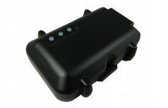

# ATrack - AL7

The ATrack AL7 is an economical fleet tracking unit that offers real-time track and trace capabilities with easy installation. Designed with a rugged IP66 waterproof casing and an internal antenna, this GPS tracker is built to withstand harsh environments and provide reliable performance. It is an ideal solution for various applications such as Motorcycle Tracking, Fleet Management, Car Rental, and Small & Medium-Sized Enterprises.

One of the standout features of the AL7 is its wide operating voltage range, which allows it to work with a power supply ranging from 6V to 30V. This flexibility makes it compatible with a wide range of vehicles and ensures reliable operation even in challenging conditions. The AL7 also offers flexible wireless network options, allowing for seamless connectivity and data communication via SMS, TCP, or UDP.

With its high GPS sensitivity and built-in G-sensor for motion detection, the AL7 provides accurate and real-time tracking information. It also offers configurable power management and over speeding detection, allowing users to optimize power consumption and monitor driving behavior. Additionally, the AL7 features a configurable real-time tracking and logging system, allowing users to define their own reports and track specific events or locations.

Overall, the ATrack AL7 is a reliable and cost-effective GPS tracker that offers a range of features and capabilities for fleet tracking and management. Its easy installation, waterproof casing, and user-defined reports make it a versatile solution for various industries and applications.

### Key Features:

- Wide operating voltage range from 6V to 30V
- Flexible wireless network options
- 3-wire easy installation
- Ultra low current consumption in deep sleep mode
- Data communication by SMS/TCP/UDP
- High GPS sensitivity
- Built-in G-sensor for motion detection
- FOTA firmware upgrade using FTP
- Configurable Real Time Tracking & Logging
- 32 user-defined geofences
- Roaming preference settings\*
- Harsh driving behavior events
- Configurable power management
- Over speeding detection
- IP66 waterproof casing
- Intelligent event control engine
- Buffered event message of 18,000 positions \(equals to 140-day logging data with an interval of 1 minute\)
- \*AL7\(CV\) and AL7\(CS\) are not supporting roaming preference feature

